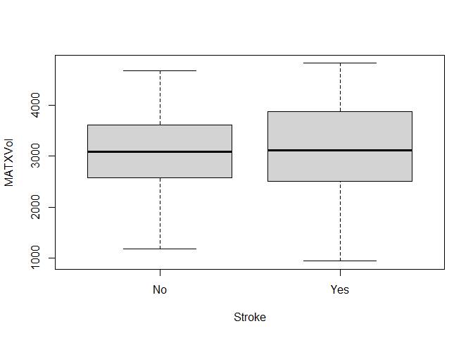
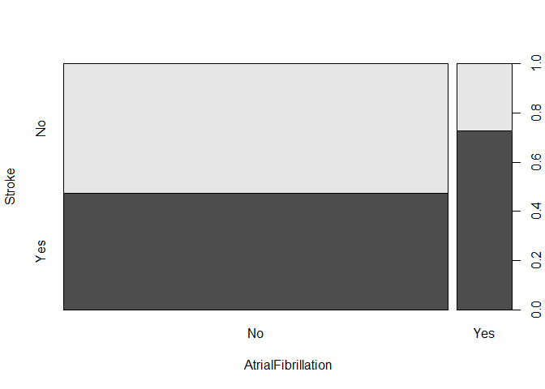
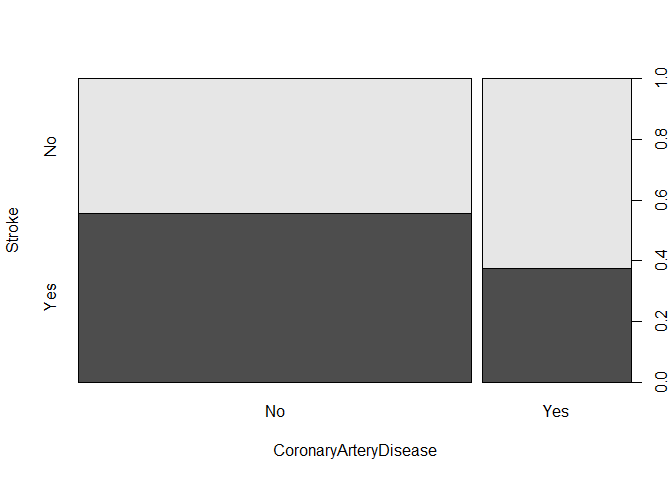
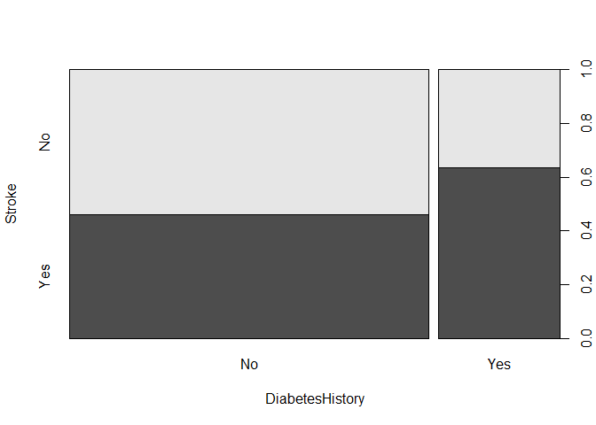

<br>

### Analysis

1.  Brain weight data. 
    a. Using the function ``KNN.reg`` in the ``FNN`` package to construct predictive models for brain weight using KNN regression for $K=1,..,15$ on a training set (use the exact same training/validation split--same seed and same split percentages--you used for linear regression). Hint: use a for loop to iterate over $K$.
    

```r
library(FNN)
brain<-read.table("brain.txt", header = TRUE)
head(brain)
```

```
##   Sex Age Head.size Brain.weight
## 1   1   1      4512         1530
## 2   1   1      3738         1297
## 3   1   1      4261         1335
## 4   1   1      3777         1282
## 5   1   1      4177         1590
## 6   1   1      3585         1300
```

```r
n = nrow(brain)
trainset = sample(1:n, floor(0.7*n))
brain_train = brain[trainset,]; n_train = nrow(brain_train)
brain_val = brain[-trainset,]; n_test = nrow(brain_val)

Rsq<-function(obs, pred){
  dif = obs - pred
  sqrt(mean(dif^2))
}

Rsq<-function(obs, pred){
  RSS = sum((obs-pred)^2)
  TSS = sum((obs-mean(obs))^2)
  R2 = 1-RSS/TSS
  print(R2)
}
```


```r
rmse <- data.frame(1:15,0,0)
colnames(rmse) <- c("k","rmse","R2")
for (i in 1:15){
  fit_nNN <- knn.reg(train = brain_train[,-4, drop = FALSE], test = brain_val[,-4, drop = FALSE], y = brain_train$Brain.weight, k = i)
  dif = brain_val$Brain.weight - fit_nNN$pred
  RSS = sum((brain_val$Brain.weight-fit_nNN$pred)^2)
  TSS = sum((brain_val$Brain.weight-mean(brain_val$Brain.weight))^2)
  R2 = 1-RSS/TSS
  rmse[i,] <- data.frame(i, sqrt(mean(dif^2)), R2)
}
```
    b. Plot the validation RMSE as a function of $K$ and select the best K.

```r
library(ggplot2)
ggplot(data = rmse)+
  geom_line(mapping = aes(x = k, y = rmse))+
  labs(x = "k", y ="rmse")
```

<!-- -->


```r
library(dplyr)
```

```
## 
## Attaching package: 'dplyr'
```

```
## The following objects are masked from 'package:stats':
## 
##     filter, lag
```

```
## The following objects are masked from 'package:base':
## 
##     intersect, setdiff, setequal, union
```

```r
rmse<-arrange(rmse, rmse, .by_group = FALSE)
head(rmse, 1)
```

```
##    k    rmse        R2
## 1 15 76.1576 0.5547062
```
    c. Using the validation RMSE compare to the best linear regression model from homework 1. Is there an improvement in prediction performance?  Interpret your results based on the bias-variance tradeoff.

The prediction performance didn't improve using KNN method, probably because of overfitting by focusing too much on the training model.

<br>


2. The goal of this exercise is to fit several LDA classifiers and perform model selection using the Ischemic Stroke data set. For your convenience the code to pre-process/transform the data is provided below.

**Dataset notes:**
According to the Mayo Clinic, "ischemic stroke occurs when a blood clot blocks or narrows an artery leading to the brain. A blood clot often forms in arteries damaged by the buildup of plaques (atherosclerosis). It can occur in the carotid artery of the neck as well as other arteries. This is the most common type of stroke." (https://www.mayoclinic.org/diseases-conditions/stroke/symptoms-causes/syc-20350113#:~:text=Ischemic%20stroke%20occurs%20when%20a,most%20common%20type%20of%20stroke.)

a. When splitting the data into training, validation and testing or classification problems it is important to ensure each set retains approximately the same proportion of positive and negative examples as the full data. Split the data into training (70%), and validation (30%), but keeping the proportion of positive and negative examples roughly the same in the training and validation sets. This can be accomplished by sampling in a stratified manner, i.e. sampling 70/30 within the negative and the positive classes. Use the code below to perform stratified splitting. 

```r
# Code for reading in stroke data and converting categorical variables to factors 
# To run chunk set options above to eval=TRUE 

stroke = read.csv("stroke.csv" )
str(stroke)
```

```
## 'data.frame':	126 obs. of  30 variables:
##  $ X                          : int  1 2 4 5 7 8 9 10 14 15 ...
##  $ Stroke                     : chr  "N" "N" "N" "Y" ...
##  $ NASCET                     : int  0 0 0 0 0 0 0 0 0 0 ...
##  $ CALCVol                    : num  235.3 31.4 113.4 780.8 84.1 ...
##  $ CALCVolProp                : num  0.0704 0.0162 0.0381 0.2134 0.0414 ...
##  $ MATXVol                    : num  3157 3033 3835 3519 2990 ...
##  $ MATXVolProp                : num  0.76 0.813 0.783 0.761 0.75 ...
##  $ LRNCVol                    : num  225 369 321 141 293 ...
##  $ LRNCVolProp                : num  0.0911 0.134 0.083 0.0321 0.0754 ...
##  $ MaxCALCArea                : num  12.35 7.13 16.29 63.35 17.58 ...
##  $ MaxCALCAreaProp            : num  0.366 0.211 0.409 0.576 0.322 ...
##  $ MaxDilationByArea          : num  521 91.7 271 2270.5 95.2 ...
##  $ MaxMATXArea                : num  71.2 27.2 38.1 341.1 56.6 ...
##  $ MaxMATXAreaProp            : num  0.952 0.946 0.946 0.969 0.921 ...
##  $ MaxLRNCArea                : num  21.69 6.43 5.71 6.05 7.21 ...
##  $ MaxLRNCAreaProp            : num  0.43 0.282 0.155 0.187 0.217 ...
##  $ MaxMaxWallThickness        : num  2.41 2.54 3.71 6.12 3.98 ...
##  $ MaxRemodelingRatio         : num  5.7 1.74 2.83 15.65 1.91 ...
##  $ MaxStenosisByArea          : num  19 30.2 33.9 34.3 36.6 ...
##  $ MaxWallArea                : num  106.2 33.4 55.3 426.5 59.8 ...
##  $ WallVol                    : num  4192 3917 4935 4910 4045 ...
##  $ MaxStenosisByDiameter      : num  10.5 18.6 19.7 20.3 49.3 ...
##  $ age                        : int  72 76 72 61 65 64 82 83 85 56 ...
##  $ sex                        : int  1 1 0 1 1 1 0 0 0 0 ...
##  $ SmokingHistory             : int  1 1 0 1 0 1 1 0 1 1 ...
##  $ AtrialFibrillation         : int  0 0 0 0 0 0 0 1 0 0 ...
##  $ CoronaryArteryDisease      : int  0 0 0 0 0 1 1 1 1 0 ...
##  $ DiabetesHistory            : int  0 1 0 1 0 0 0 0 0 0 ...
##  $ HypercholesterolemiaHistory: int  0 1 0 1 0 1 0 0 1 0 ...
##  $ HypertensionHistory        : int  1 1 0 1 1 1 1 1 1 0 ...
```

```r
stroke$Stroke                      <- factor(stroke$Stroke, levels=c('N', 'Y'), labels=c("No", "Yes"))
stroke$NASCET                      <- factor(stroke$NASCET, levels=0:1, labels=c("No", "Yes"))
stroke$sex                         <- factor(stroke$sex, levels=0:1, labels=c("Female", "Male"))
stroke$SmokingHistory              <- factor(stroke$SmokingHistory, levels=0:1, labels=c("No", "Yes"))
stroke$AtrialFibrillation          <- factor(stroke$AtrialFibrillation, levels=0:1, labels=c("No", "Yes"))
stroke$CoronaryArteryDisease       <- factor(stroke$CoronaryArteryDisease, levels=0:1, labels=c("No", "Yes"))
stroke$DiabetesHistory             <- factor(stroke$DiabetesHistory, levels=0:1, labels=c("No", "Yes"))
stroke$HypercholesterolemiaHistory <- factor(stroke$HypercholesterolemiaHistory, levels=0:1, labels=c("No", "Yes"))
stroke$HypertensionHistory         <- factor(stroke$HypertensionHistory, levels=0:1, labels=c("No", "Yes"))
```


```r
# Code for splitting data into trainin and validation 
# To run chunk set options above to eval=TRUE 

n = nrow(stroke)
positives = (1:n)[stroke$Stroke=='Yes']
negatives = (1:n)[stroke$Stroke=='No']

positives_train = sample(positives, floor(0.7*length(positives)))
positives_val = setdiff(positives, positives_train)

negatives_train = sample(negatives, floor(0.7*length(negatives)))
negatives_val = setdiff(negatives, negatives_train)

stroke_train = stroke[c(positives_train, negatives_train), ]
stroke_val = stroke[c(positives_val, negatives_val), ]

ntrain = nrow(stroke_train); nval=nrow(stroke_val)

table(stroke_train$Stroke)
```

```
## 
##  No Yes 
##  43  44
```

```r
table(stroke_val$Stroke)
```

```
## 
##  No Yes 
##  19  20
```


Note: Because of the moderate sample size we will not have a separate test set -- we will learn later in the course about cross-validation, which will allow us to split the data into training and testing only and still perform model selection.
    
a. Read in the data and convert all categorical variables to factors (use code below). Split the data into a training (70%) and validation (30%) using stratified dampling (use code below). Using the training data, graphically assess each of the predictors using a boxplot for quantitative predictors and a mosaic plot for a categorical predictors. Note: you can use plot to get these graphs. Use for example ``boxplot(your_predictor ~ Stroke, data=stroke_train)`` to get a boxplot for a quantitative predictor and ``plot(Stroke, your_predictor, data=stroke_train)`` for a categorical predictor to get a mosaic plot. Visually determine the 3 most most predictive **imaging features**, i.e. the imaging features that best separate the stroke=YES vs. stroke='No' classes. (This is an informal procedure since a visual assessment is inherently subjective, in a future class we will learn how to do feature selection in a systematic way).

```r
boxplot(CALCVol~Stroke, data = stroke_train)
```

<!-- -->

```r
boxplot(CALCVolProp~Stroke, data = stroke_train)
```

<!-- -->

```r
boxplot(MATXVol~Stroke, data = stroke_train)
```

<!-- -->

```r
boxplot(MATXVolProp~Stroke, data = stroke_train)
```

<!-- -->

```r
boxplot(LRNCVol~Stroke, data = stroke_train)
```

<!-- -->

```r
boxplot(LRNCVolProp~Stroke, data = stroke_train)
```

<!-- -->

```r
boxplot(MaxCALCArea~Stroke, data = stroke_train)
```

<!-- -->

```r
boxplot(MaxCALCAreaProp~Stroke, data = stroke_train)
```

<!-- -->

```r
boxplot(MaxDilationByArea~Stroke, data = stroke_train)
```

<!-- -->

```r
boxplot(MaxMATXArea~Stroke, data = stroke_train)
```

<!-- -->

```r
boxplot(MaxMATXAreaProp~Stroke, data = stroke_train)
```

<!-- -->

```r
boxplot(MaxLRNCArea~Stroke, data = stroke_train)
```

<!-- -->

```r
boxplot(MaxMaxWallThickness~Stroke, data = stroke_train)
```

<!-- -->

```r
boxplot(MaxRemodelingRatio~Stroke, data = stroke_train)
```

<!-- -->

```r
boxplot(MaxStenosisByArea~Stroke, data = stroke_train)
```

<!-- -->

```r
boxplot(MaxWallArea~Stroke, data = stroke_train)
```

<!-- -->

```r
boxplot(WallVol~Stroke, data = stroke_train)
```

<!-- -->

```r
boxplot(MaxStenosisByDiameter~Stroke, data = stroke_train)
```

<!-- -->

```r
boxplot(age~Stroke, data = stroke_train)
```

<!-- -->

```r
plot(Stroke~NASCET, data=stroke_train)
```

<!-- -->

```r
plot(Stroke~sex, data = stroke_train)
```

<!-- -->

```r
plot(Stroke~SmokingHistory, data = stroke_train)
```

<!-- -->

```r
plot(Stroke~AtrialFibrillation, data = stroke_train)
```

<!-- -->

```r
plot(Stroke~CoronaryArteryDisease, data = stroke_train)
```

<!-- -->

```r
plot(Stroke~DiabetesHistory, data = stroke_train)
```

<!-- -->

```r
plot(Stroke~HypercholesterolemiaHistory, data = stroke_train)
```

<!-- -->

```r
plot(Stroke~HypertensionHistory, data = stroke_train)
```

<!-- -->
    
b. Build LDA classifiers of increasing complexity by including: i) age, sex, and smoking history; ii) all the previous features  + the clinical variables AtrialFibrillation, CoronaryArteryDisease, DiabetesHistory, HypercholesterolemiaHistory, and HypertensionHistory; iii) all the previous features + the most predictive imaging feature based on part b; and iv) all the previous features + the next 2 most predictive imaging features.

```r
require(MASS)
stroke_lda = lda(Stroke ~ age + sex + SmokingHistory , data=stroke_train)
stroke_lda
```

```
## Call:
## lda(Stroke ~ age + sex + SmokingHistory, data = stroke_train)
## 
## Prior probabilities of groups:
##        No       Yes 
## 0.4942529 0.5057471 
## 
## Group means:
##          age   sexMale SmokingHistoryYes
## No  70.06977 0.6279070         0.5813953
## Yes 74.65909 0.5454545         0.5000000
## 
## Coefficients of linear discriminants:
##                           LD1
## age                0.08550037
## sexMale           -0.56728844
## SmokingHistoryYes -0.35454975
```


```r
stroke_lda2 = lda(Stroke ~ age + sex + SmokingHistory + AtrialFibrillation + CoronaryArteryDisease + DiabetesHistory + HypercholesterolemiaHistory + HypertensionHistory , data=stroke_train)
stroke_lda2
```

```
## Call:
## lda(Stroke ~ age + sex + SmokingHistory + AtrialFibrillation + 
##     CoronaryArteryDisease + DiabetesHistory + HypercholesterolemiaHistory + 
##     HypertensionHistory, data = stroke_train)
## 
## Prior probabilities of groups:
##        No       Yes 
## 0.4942529 0.5057471 
## 
## Group means:
##          age   sexMale SmokingHistoryYes AtrialFibrillationYes
## No  70.06977 0.6279070         0.5813953            0.06976744
## Yes 74.65909 0.5454545         0.5000000            0.18181818
##     CoronaryArteryDiseaseYes DiabetesHistoryYes HypercholesterolemiaHistoryYes
## No                 0.3488372          0.1860465                      0.5116279
## Yes                0.2045455          0.3181818                      0.5681818
##     HypertensionHistoryYes
## No               0.7441860
## Yes              0.7954545
## 
## Coefficients of linear discriminants:
##                                        LD1
## age                             0.05141364
## sexMale                        -0.48979099
## SmokingHistoryYes              -0.07432977
## AtrialFibrillationYes           1.58903216
## CoronaryArteryDiseaseYes       -1.48150596
## DiabetesHistoryYes              0.91349884
## HypercholesterolemiaHistoryYes  0.40575727
## HypertensionHistoryYes         -0.41600233
```


```r
stroke_lda3 <- lda(Stroke ~ age + sex + SmokingHistory + AtrialFibrillation + CoronaryArteryDisease + DiabetesHistory + HypercholesterolemiaHistory + HypertensionHistory + MaxMaxWallThickness, data=stroke_train)
stroke_lda3
```

```
## Call:
## lda(Stroke ~ age + sex + SmokingHistory + AtrialFibrillation + 
##     CoronaryArteryDisease + DiabetesHistory + HypercholesterolemiaHistory + 
##     HypertensionHistory + MaxMaxWallThickness, data = stroke_train)
## 
## Prior probabilities of groups:
##        No       Yes 
## 0.4942529 0.5057471 
## 
## Group means:
##          age   sexMale SmokingHistoryYes AtrialFibrillationYes
## No  70.06977 0.6279070         0.5813953            0.06976744
## Yes 74.65909 0.5454545         0.5000000            0.18181818
##     CoronaryArteryDiseaseYes DiabetesHistoryYes HypercholesterolemiaHistoryYes
## No                 0.3488372          0.1860465                      0.5116279
## Yes                0.2045455          0.3181818                      0.5681818
##     HypertensionHistoryYes MaxMaxWallThickness
## No               0.7441860            4.482633
## Yes              0.7954545            6.754928
## 
## Coefficients of linear discriminants:
##                                        LD1
## age                             0.05317536
## sexMale                        -0.36745363
## SmokingHistoryYes              -0.02566464
## AtrialFibrillationYes           1.52349842
## CoronaryArteryDiseaseYes       -1.39274635
## DiabetesHistoryYes              0.83572219
## HypercholesterolemiaHistoryYes  0.44437269
## HypertensionHistoryYes         -0.49527015
## MaxMaxWallThickness             0.04303021
```

```r
stroke_lda4 <- lda(Stroke ~ age + sex + SmokingHistory + AtrialFibrillation + CoronaryArteryDisease + DiabetesHistory + HypercholesterolemiaHistory + HypertensionHistory + MaxMaxWallThickness + MaxStenosisByArea + MATXVol, data=stroke_train)
stroke_lda4
```

```
## Call:
## lda(Stroke ~ age + sex + SmokingHistory + AtrialFibrillation + 
##     CoronaryArteryDisease + DiabetesHistory + HypercholesterolemiaHistory + 
##     HypertensionHistory + MaxMaxWallThickness + MaxStenosisByArea + 
##     MATXVol, data = stroke_train)
## 
## Prior probabilities of groups:
##        No       Yes 
## 0.4942529 0.5057471 
## 
## Group means:
##          age   sexMale SmokingHistoryYes AtrialFibrillationYes
## No  70.06977 0.6279070         0.5813953            0.06976744
## Yes 74.65909 0.5454545         0.5000000            0.18181818
##     CoronaryArteryDiseaseYes DiabetesHistoryYes HypercholesterolemiaHistoryYes
## No                 0.3488372          0.1860465                      0.5116279
## Yes                0.2045455          0.3181818                      0.5681818
##     HypertensionHistoryYes MaxMaxWallThickness MaxStenosisByArea  MATXVol
## No               0.7441860            4.482633          69.53116 3063.601
## Yes              0.7954545            6.754928          77.70156 3173.474
## 
## Coefficients of linear discriminants:
##                                          LD1
## age                             0.0408611813
## sexMale                        -0.5162741283
## SmokingHistoryYes              -0.0157934091
## AtrialFibrillationYes           1.1991640860
## CoronaryArteryDiseaseYes       -1.4096102006
## DiabetesHistoryYes              0.7626296024
## HypercholesterolemiaHistoryYes  0.3686103704
## HypertensionHistoryYes         -0.4782880834
## MaxMaxWallThickness             0.0244026110
## MaxStenosisByArea               0.0306266110
## MATXVol                         0.0003329039
```
    
c. Write an R function ``classificationError`` to compute the overall misclassification error, specificity, and sensitivity of a classifier. The function should take a confusion matrix as its input (which you can create using ``table`` as shown in the lecture) and return a vector with the overall misclassication error, specificity and sensitivity. (Hint: separately compute the three quantities ``error``, ``spec``, and ``sens`` inside the body of the function and then put them together in a vector using ``c(error=error, sensitivity=sens, specificity=spec)`` in the last line of the body of the function before the closing ``}`` -- the last line is by default what a function returns. The returned object can be any R object including a siggle number, a vector, a data.frame or even another function!)

```r
ClassificationError<-function(confmatrix){
  error = round((confmatrix[1,2]+confmatrix[2,1])/(confmatrix[1,1]+confmatrix[1,2]+confmatrix[2,1]+confmatrix[2,2]),2)
  spec = round(confmatrix[1,1]/(confmatrix[1,1]+confmatrix[1,2]),2)
  sens = round(confmatrix[2,2]/(confmatrix[2,1]+confmatrix[2,2]),2)
  print(c(error=error, sensitivity=sens, specificity=spec))
}
```

d. Compute the training and test errors for each of the classifiers in e. Which classifier would you choose?

```r
pred_lda_train = predict(stroke_lda, newdata=stroke_train)
confMatrix_train = table(true=stroke_train$Stroke, predicted=pred_lda_train$class)
trainer1<-ClassificationError(confMatrix_train)
```

```
##       error sensitivity specificity 
##        0.43        0.57        0.58
```

```r
pred_lda_train2 = predict(stroke_lda2, newdata=stroke_train)
confMatrix_train2 = table(true=stroke_train$Stroke, predicted=pred_lda_train2$class)
trainer2<-ClassificationError(confMatrix_train2)
```

```
##       error sensitivity specificity 
##        0.37        0.64        0.63
```

```r
pred_lda_train3 = predict(stroke_lda3, newdata=stroke_train)
confMatrix_train3 = table(true=stroke_train$Stroke, predicted=pred_lda_train3$class)
trainer3<-ClassificationError(confMatrix_train3)
```

```
##       error sensitivity specificity 
##        0.36        0.68        0.60
```

```r
pred_lda_train4 = predict(stroke_lda4, newdata=stroke_train)
confMatrix_train4 = table(true=stroke_train$Stroke, predicted=pred_lda_train4$class)
trainer4<-ClassificationError(confMatrix_train4)
```

```
##       error sensitivity specificity 
##        0.30        0.68        0.72
```


```r
pred_lda_val = predict(stroke_lda, newdata=stroke_val)
confMatrix_val = table(true=stroke_val$Stroke, predicted=pred_lda_val$class)
tester1<-ClassificationError(confMatrix_val)
```

```
##       error sensitivity specificity 
##        0.59        0.40        0.42
```

```r
pred_lda_val2 = predict(stroke_lda2, newdata=stroke_val)
confMatrix_val2 = table(true=stroke_val$Stroke, predicted=pred_lda_val2$class)
tester2<-ClassificationError(confMatrix_val2)
```

```
##       error sensitivity specificity 
##        0.54        0.35        0.58
```

```r
pred_lda_val3 = predict(stroke_lda3, newdata=stroke_val)
confMatrix_val3 = table(true=stroke_val$Stroke, predicted=pred_lda_val3$class)
tester3<-ClassificationError(confMatrix_val3)
```

```
##       error sensitivity specificity 
##        0.41        0.45        0.74
```

```r
pred_lda_val4 = predict(stroke_lda4, newdata=stroke_val)
confMatrix_val4 = table(true=stroke_val$Stroke, predicted=pred_lda_val4$class)
tester4<-ClassificationError(confMatrix_val4)
```

```
##       error sensitivity specificity 
##        0.38        0.65        0.58
```


```r
train_error <- c(trainer1[1], trainer2[1], trainer3[1],trainer4[1])
test_error <- c(tester1[1], tester2[1], tester3[1],tester4[1])
complexity <- c(1,2,3,4)
tb <- data.frame(train_error, test_error, complexity)
knitr::kable(tb)
```


| train_error| test_error| complexity|
|-----------:|----------:|----------:|
|        0.43|       0.59|          1|
|        0.37|       0.54|          2|
|        0.36|       0.41|          3|
|        0.30|       0.38|          4|
e. Plot in the same graph the training and test misclassification error as a function of classifier complexity. Comment/interpret the plots.

```r
ggplot(data = tb) +
  geom_line(mapping = aes(x = complexity, y = train_error, color = "train error")) +
  geom_line(mapping = aes(x = complexity, y = test_error, color = "test error")) +
  labs(x = "classifier complexity", y = "misclassification error", title = "Lineplot of misclassification and complexity") 
```

<!-- -->


```r
cor.test(complexity,train_error)
```

```
## 
## 	Pearson's product-moment correlation
## 
## data:  complexity and train_error
## t = -5.6569, df = 2, p-value = 0.02986
## alternative hypothesis: true correlation is not equal to 0
## 95 percent confidence interval:
##  -0.9993988 -0.1339389
## sample estimates:
##        cor 
## -0.9701425
```

```r
cor.test(complexity,test_error)
```

```
## 
## 	Pearson's product-moment correlation
## 
## data:  complexity and test_error
## t = -5.7949, df = 2, p-value = 0.02851
## alternative hypothesis: true correlation is not equal to 0
## 95 percent confidence interval:
##  -0.9994263 -0.1568572
## sample estimates:
##       cor 
## -0.971489
```
The misclassification error of both train set and validation set both decreases as the classifier increases. The test on correlation coefficients show that there are significant linear association on complexity and misclassification error. 


 
