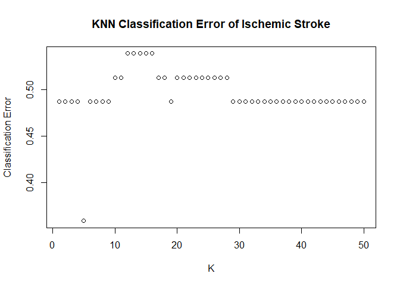

<br>


## Exercise 1

a) Build a KNN classifier to predict stroke using the ischemic stroke data and tune the complexity parameter $\,K=1,\ldots,50$ using a single-split validation set. As features use "sex", "age", "CoronaryArteryDisease", "MaxStenosisByDiameter" and "MATXVolProp"). Plot the classification error as a function of $\,K$. Which value of $K$ do you choose? Explain. 

```r
set.seed(777)
# required packages
library(MASS)
library(pROC)
library(FNN)
require(mlr3)
require(mlr3learners)
require(mlr3proba)
require(mlr3viz)

# read in data
stroke = read.csv("stroke.csv")

# factor binary variables
stroke$Stroke                      <- factor(stroke$Stroke, levels=c('N', 'Y'), labels=c("No", "Yes"))
stroke$NASCET                      <- factor(stroke$NASCET, labels=c("No", "Yes"))
stroke$sex                         <- factor(stroke$sex, labels=c("Female", "Male"))
stroke$SmokingHistory              <- factor(stroke$SmokingHistory, labels=c("No", "Yes"))
stroke$AtrialFibrillation          <- factor(stroke$AtrialFibrillation, labels=c("No", "Yes"))
stroke$CoronaryArteryDisease       <- factor(stroke$CoronaryArteryDisease, labels=c("No", "Yes"))
stroke$DiabetesHistory             <- factor(stroke$DiabetesHistory, labels=c("No", "Yes"))
stroke$HypercholesterolemiaHistory <- factor(stroke$HypercholesterolemiaHistory, labels=c("No", "Yes"))
stroke$HypertensionHistory         <- factor(stroke$HypertensionHistory, labels=c("No", "Yes"))
```


```r
n = nrow(stroke)
positives = (1:n)[stroke$Stroke=='Yes']
negatives = (1:n)[stroke$Stroke=='No']

positives_train = sample(positives, floor(0.7*length(positives)))
positives_val = setdiff(positives, positives_train)

negatives_train = sample(negatives, floor(0.7*length(negatives)))
negatives_val = setdiff(negatives, negatives_train)

rowstrain = c(positives_train, negatives_train)
rowsval = c(positives_val, negatives_val)

stroke_train = stroke[c(positives_train, negatives_train), ]
stroke_val = stroke[c(positives_val, negatives_val), ]

ntrain = nrow(stroke_train); nval=nrow(stroke_val)

table(stroke_train$Stroke)
```

```
## 
##  No Yes 
##  43  44
```

```r
table(stroke_val$Stroke)
```

```
## 
##  No Yes 
##  19  20
```


```r
stroke.tsk  <- as_task_classif(stroke,
                              target = "Stroke",
                              positive = "Yes",
                              id = "Ischemic Stroke") 

#select a subset of the features (more or less arbitrarily chosen for now. Next week we will learn feature selection methods)
stroke.tsk$select(c("sex", "age", "CoronaryArteryDisease", "MaxStenosisByDiameter", "MATXVolProp"))


# examine task
print(stroke.tsk)
```

```
## <TaskClassif:Ischemic Stroke> (126 x 6)
## * Target: Stroke
## * Properties: twoclass
## * Features (5):
##   - fct (2): CoronaryArteryDisease, sex
##   - dbl (2): MATXVolProp, MaxStenosisByDiameter
##   - int (1): age
```

```r
# create plots
require(mlr3viz)
require(GGally)
autoplot(stroke.tsk)                  # plots only the outcome
```

<!-- -->

```r
autoplot(stroke.tsk, type="duo")      # plots the outcome vs. the features
```

<!-- -->

```r
autoplot(stroke.tsk, type="pairs")    # plots the all pairs of features (including outcome). Can become infeasible if too many features.
```

<!-- -->


```r
require(mlr3learners) # package for additional machine learning methods
require(kknn)         # package for KNN method

# define the learner as KNN with K=1
stroke.lrn <- lrn("classif.kknn", k = 1)
```


```r
stroke.lrn$train(stroke.tsk, row_ids = rowstrain)
```


```r
# predict in validation set
stroke_predict <- stroke.lrn$predict(stroke.tsk, row_ids = rowsval)

# test confusion matrix 
stroke_predict$confusion
```

```
##         truth
## response Yes No
##      Yes  10  9
##      No   10 10
```

```r
# Sensitivity and specificity
stroke_predict$score(msr("classif.sensitivity"))
```

```
## classif.sensitivity 
##                 0.5
```

```r
stroke_predict$score(msr("classif.specificity"))
```

```
## classif.specificity 
##           0.5263158
```

```r
# accuracy and classification error
stroke_predict$score(msr("classif.ce"))
```

```
## classif.ce 
##  0.4871795
```

```r
stroke_predict$score(msr("classif.acc"))
```

```
## classif.acc 
##   0.5128205
```


```r
# create empty vectors to hold performance measures
stroke_sensitivity <- numeric(50)
stroke_specificity <- numeric(50)
stroke_ce          <- numeric(50)
stroke_acc         <- numeric(50)


for (i in 1:50) {
  
  stroke.lrn <- lrn("classif.kknn", k = i)
  
  stroke.lrn$train(stroke.tsk, row_ids=rowstrain)
  
  stroke_predict <- stroke.lrn$predict(stroke.tsk, row_ids = rowsval)

  # confusion matrix pieces
  stroke_sensitivity[i] <- stroke_predict$score(msr("classif.sensitivity"))
  stroke_specificity[i] <- stroke_predict$score(msr("classif.specificity"))

  # accuracy and classification error
  stroke_ce[i]  <- stroke_predict$score(msr("classif.ce"))
  stroke_acc[i] <- stroke_predict$score(msr("classif.acc"))
  
}
```


```r
k<-c(1:50)
plot(x = k, y = stroke_ce, 
     main = "KNN Classification Error of Ischemic Stroke", xlab = "K", ylab = "Classification Error")
```

<!-- -->

b) Repeat a) 9 additional times with different random training/validation splits (use a loop). Plot the 10 curves, analogs to the one obtained in a. in the same graph. Do you choose the same value of $\,K$ for each of the 10 splits? What does this say about the stability/variability of using a single training/validation split to perform model selection? 


```r
sensitivity <- matrix(nrow = 50, ncol = 9)
specificity <- matrix(nrow = 50, ncol = 9)
stroke_ce2 <- matrix(nrow = 50, ncol = 9)
stroke_acc2 <- matrix(nrow = 50, ncol = 9)
for (j in 1:9){
  positives_train = sample(positives, floor(0.7*length(positives)))
  positives_val = setdiff(positives, positives_train)
  negatives_train = sample(negatives, floor(0.7*length(negatives)))
  negatives_val = setdiff(negatives, negatives_train)
  rowstrain = c(positives_train, negatives_train)
  rowsval = c(positives_val, negatives_val)
  stroke_train = stroke[c(positives_train, negatives_train), ]
  stroke_val = stroke[c(positives_val, negatives_val), ]
  for (i in 1:50) {
    stroke.lrn <- lrn("classif.kknn", k = i)
    stroke.lrn$train(stroke.tsk, row_ids=rowstrain)
    stroke_predict <- stroke.lrn$predict(stroke.tsk, row_ids = rowsval)
    sensitivity[i,j] <- stroke_predict$score(msr("classif.sensitivity"))
    specificity[i,j] <- stroke_predict$score(msr("classif.specificity"))
    stroke_ce2[i,j]  <- stroke_predict$score(msr("classif.ce"))
    stroke_acc2[i,j] <- stroke_predict$score(msr("classif.acc"))
  }
}
```


```r
stroke_ce_df <- data.frame(stroke_ce, stroke_ce2, k)
ggplot(data = stroke_ce_df)+
  geom_point(mapping = aes(x = k, y = stroke_ce, color="a"))+
  geom_point(mapping = aes(x = k, y = X1, color="b1"))+
  geom_point(mapping = aes(x = k, y = X2, color="b2"))+
  geom_point(mapping = aes(x = k, y = X3, color="b3"))+
  geom_point(mapping = aes(x = k, y = X4, color="b4"))+
  geom_point(mapping = aes(x = k, y = X5, color="b5"))+
  geom_point(mapping = aes(x = k, y = X6, color="b6"))+
  geom_point(mapping = aes(x = k, y = X7, color="b7"))+
  geom_point(mapping = aes(x = k, y = X8, color="b8"))+
  geom_point(mapping = aes(x = k, y = X9, color="b9"))
```

<!-- -->

```r
  labs(x = "k", y = "classification error")
```

```
## $x
## [1] "k"
## 
## $y
## [1] "classification error"
## 
## attr(,"class")
## [1] "labels"
```
We don't choose the same value of k for each of the splits. Using a single training/validation split to perform model selection is unstable.

c) Now tune the complexity parameter $\,K=1,\ldots,50$ using now 5-fold cross-validation instead of a single training/validation split. Which value of $k$ do you choose? Explain. 

```r
# sets options in mlr3 to suppress verbose output
lgr::get_logger("mlr3")$set_threshold("warn")    
lgr::get_logger("bbotk")$set_threshold("warn")

# create empty vectors to hold performance measures
stroke.cv_ce <- numeric(30)

for (i in 1:50) {
  knn.lrn <- lrn("classif.kknn", k = i)
  
  # create and run the resampling object, for 5-fold cv
  cv <- rsmp("cv", folds = 5)
  stroke.rr <- resample(stroke.tsk, knn.lrn, cv, store_models = TRUE)

  # accuracy and classification error
  stroke.cv_ce[i]  <- stroke.rr$aggregate(msr("classif.ce"))
}

plot(x = k, y = stroke.cv_ce, 
     main = "Classification Error using 5 folds cv", xlab = "K", ylab = "Classification Error")
```

<!-- -->
We pick k=10 as it yields the least classification error.

d) Repeat c) 9 additional times with different cross-validation splits (use a loop). Plot the 10 curves, analogs to the one obtained in c. in the same graph. Do you choose the same value of $\,K$ for each of the 10 splits? What does this say about the stability/variability of using cross/validation to perform model selection compared to a single split? 

```r
stroke.cv_ce2 <- matrix(nrow = 50, ncol = 9)
for (j in 1:9){
  positives_train = sample(positives, floor(0.7*length(positives)))
  positives_val = setdiff(positives, positives_train)
  negatives_train = sample(negatives, floor(0.7*length(negatives)))
  negatives_val = setdiff(negatives, negatives_train)
  rowstrain = c(positives_train, negatives_train)
  rowsval = c(positives_val, negatives_val)
  stroke_train = stroke[c(positives_train, negatives_train), ]
  stroke_val = stroke[c(positives_val, negatives_val), ]
  for (i in 1:50) {
  knn.lrn2 <- lrn("classif.kknn", k = i)
  
  # create and run the resampling object, for 5-fold cv
  cv2 <- rsmp("cv", folds = 5)
  stroke.rr2 <- resample(stroke.tsk, knn.lrn, cv2, store_models = TRUE)

  # accuracy and classification error
  stroke.cv_ce2[i,j]  <- stroke.rr2$aggregate(msr("classif.ce"))
  }
}
```


```r
stroke_ce_df2 <- data.frame(stroke.cv_ce, stroke.cv_ce2, k)
ggplot(data = stroke_ce_df2)+
  geom_point(mapping = aes(x = k, y = stroke_ce, color="c"))+
  geom_point(mapping = aes(x = k, y = X1, color="d1"))+
  geom_point(mapping = aes(x = k, y = X2, color="d2"))+
  geom_point(mapping = aes(x = k, y = X3, color="d3"))+
  geom_point(mapping = aes(x = k, y = X4, color="d4"))+
  geom_point(mapping = aes(x = k, y = X5, color="d5"))+
  geom_point(mapping = aes(x = k, y = X6, color="d6"))+
  geom_point(mapping = aes(x = k, y = X7, color="d7"))+
  geom_point(mapping = aes(x = k, y = X8, color="d8"))+
  geom_point(mapping = aes(x = k, y = X9, color="d9"))
```

<!-- -->

```r
  labs(x = "k", y = "classification error")
```

```
## $x
## [1] "k"
## 
## $y
## [1] "classification error"
## 
## attr(,"class")
## [1] "labels"
```
We don't choose the same value of k for each of the splits. Using a single training/validation split to perform model selection is unstable.

## Exercise 2.

Using the ischemic stroke data with the same features than in exercise 1, train an evaluate the performance of an LDA, QDA, and logistic regression classifiers using the mlr3 package. Plot the ROC curve and report the AUC for each of the classifiers. Compare the performance of the three classifiers. Which one would you choose for predicting stroke?

```r
n = nrow(stroke) 
positives = (1:n)[stroke$Stroke=='Yes']
negatives = (1:n)[stroke$Stroke=='No']
positives_train = sample(positives, floor(0.7*length(positives)))
positives_val = setdiff(positives, positives_train)
negatives_train = sample(negatives, floor(0.7*length(negatives)))
negatives_val = setdiff(negatives, negatives_train)
rowstrain = c(positives_train, negatives_train)
rowsval = c(positives_val, negatives_val)
stroke_train = stroke[c(positives_train, negatives_train), ]
stroke_val = stroke[c(positives_val, negatives_val), ]
ntrain = nrow(stroke_train); nval=nrow(stroke_val)
```


```r
stroke.tsk  <- as_task_classif(stroke,
                              target = "Stroke",
                              positive = "Yes",
                              id = "Ischemic Stroke") 
stroke.tsk$select(c("sex", "age", "CoronaryArteryDisease", "MaxStenosisByDiameter", "MATXVolProp"))
```


```r
stroke.lrn_qda <- lrn("classif.qda",  predict_type = "prob")

# training and validation set
stroke.lrn_qda$train(stroke.tsk, row_ids=rowstrain)
stroke_predict_qda <- stroke.lrn_qda$predict(stroke.tsk, row_ids = rowsval)

stroke_predict_qda$score(msr("classif.ce"))
```

```
## classif.ce 
##  0.5128205
```

```r
# create and run the resampling object, for 5-fold cv
cv <- rsmp("cv", folds = 5)    #repeated here for clarity but not necessary because it's already defined above
stroke.rr_qda <- resample(stroke.tsk, stroke.lrn_qda, cv, store_models = TRUE)
stroke.rr_qda$aggregate(msr("classif.ce"))
```

```
## classif.ce 
##  0.3421538
```

```r
autoplot(stroke_predict_qda, type='roc')
```

<!-- -->

```r
auc_qda<-stroke_predict_qda$score(msr("classif.auc"))
```


```r
stroke.lrn_lda <- lrn("classif.lda",  predict_type = "prob")

# training and validation set
stroke.lrn_lda$train(stroke.tsk, row_ids=rowstrain)
stroke_predict_lda <- stroke.lrn_lda$predict(stroke.tsk, row_ids = rowsval)

stroke_predict_lda$score(msr("classif.ce"))
```

```
## classif.ce 
##  0.3589744
```

```r
# create and run the resampling object, for 5-fold cv
cv <- rsmp("cv", folds = 5)    #repeated here for clarity but not necessary because it's already defined above
stroke.rr_lda <- resample(stroke.tsk, stroke.lrn_lda, cv, store_models = TRUE)
stroke.rr_lda$aggregate(msr("classif.ce"))
```

```
## classif.ce 
##  0.3261538
```

```r
autoplot(stroke_predict_lda, type='roc')
```

<!-- -->

```r
auc_lda<-stroke_predict_lda$score(msr("classif.auc"))
```


```r
stroke.lrn_log <- lrn("classif.log_reg",  predict_type = "prob")

# training and validation set
stroke.lrn_log$train(stroke.tsk, row_ids=rowstrain)
stroke_predict_log <- stroke.lrn_log$predict(stroke.tsk, row_ids = rowsval)

# create and run the resampling object, for 5-fold cv
cv <- rsmp("cv", folds = 5)    #repeated here for clarity but not necessary because it's already defined above
stroke.rr_log <- resample(stroke.tsk, stroke.lrn_qda, cv, store_models = TRUE)
stroke.rr_log$aggregate(msr("classif.ce"))
```

```
## classif.ce 
##  0.3652308
```

```r
autoplot(stroke_predict_log, type='roc')
```

<!-- -->

```r
auc_log<-stroke_predict_log$score(msr("classif.auc"))
```

```r
data.frame(auc_qda, auc_lda, auc_log)
```

```
##               auc_qda   auc_lda   auc_log
## classif.auc 0.4710526 0.6631579 0.6578947
```
We pick the lda regression as it provides the greatest classification auc.
