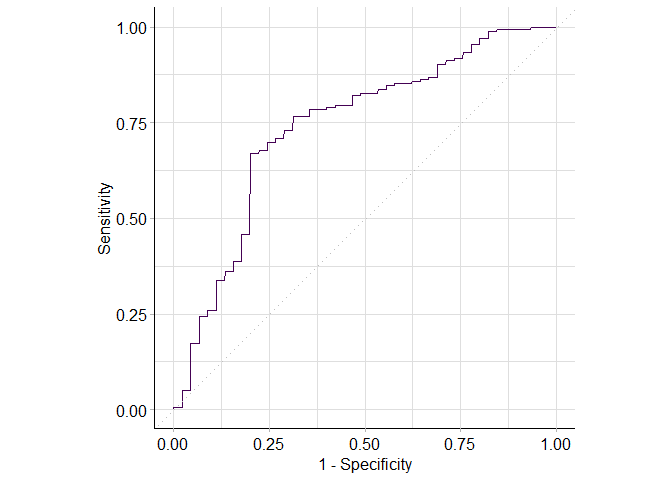
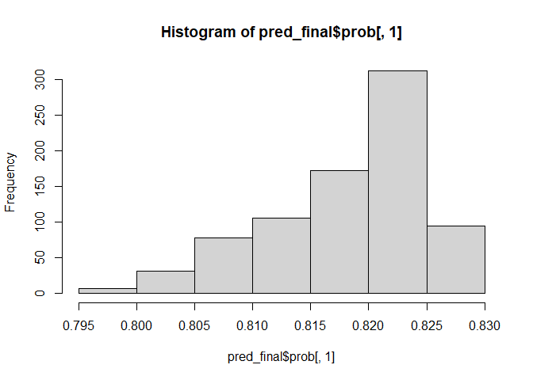
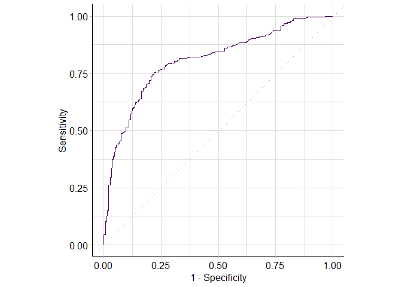

### Conceptual
The goal of this exercise is to illustrate the grouping properties of Ridge and Elastic-net compared to Lasso
Compute the full path for of solutions the Lasso, Ridge and elastic net on the data generated below using `glmnet` to generate a full path of solutions:


```r
# Simulates Features
set.seed(520)

n = 50
x1 = rnorm(n)
x2 = x1
x3 = rnorm(n)
X = cbind(x1, x2, x3)

# Simulates error/noise
e = rnorm(n, sd = 0.1)

#Simulates outcome y
y = 1 + 2*x1 + e
```


```r
lambda_grid = 10^seq(2,-2,length=n)
ridge = glmnet(X, y, family='gaussian', alpha=0, standardize=TRUE, lambda=lambda_grid)
ridge_coef = coef(ridge)
round(ridge_coef[, 42:50], 2)
```

```
## 4 x 9 sparse Matrix of class "dgCMatrix"
##               s41   s42   s43   s44   s45   s46   s47   s48  s49
## (Intercept)  0.99  0.99  0.99  0.99  0.99  0.99  0.99  0.99 0.99
## x1           0.99  0.99  0.99  1.00  1.00  1.00  1.00  1.00 1.00
## x2           0.97  0.97  0.97  0.97  0.97  0.98  0.98  0.98 0.98
## x3          -0.01 -0.01 -0.01 -0.01 -0.01 -0.01 -0.01 -0.01 0.00
```


```r
lasso = glmnet(X, y, family = "gaussian", alpha = 1)
lasso_coef = coef(lasso)
round(lasso_coef[, 42:50], 2)
```

```
## 4 x 9 sparse Matrix of class "dgCMatrix"
##              s41  s42  s43  s44  s45  s46  s47  s48  s49
## (Intercept) 0.99 0.99 0.99 0.99 0.99 0.99 0.99 0.99 0.99
## x1          1.94 1.94 1.95 1.95 1.95 1.96 1.96 1.96 1.96
## x2          .    0.00 .    .    .    .    .    .    0.00
## x3          .    .    .    .    .    .    .    .    .
```


```r
enet = glmnet(X, y, family = "gaussian", alpha = 0.5)
enet_coef = coef(enet)
round(enet_coef[, 42:50], 2)
```

```
## 4 x 9 sparse Matrix of class "dgCMatrix"
##              s41  s42  s43  s44  s45  s46  s47  s48  s49
## (Intercept) 0.99 0.99 0.99 0.99 0.99 0.99 0.99 0.99 0.99
## x1          0.97 0.98 0.98 0.98 0.99 0.99 0.99 0.99 0.99
## x2          0.95 0.95 0.95 0.95 0.95 0.95 0.96 0.96 0.96
## x3          .    .    .    .    .    .    .    .    .
```
Comment on your results regarding grouping effects of the estimated coefficients.\
The estimated coefficients of x1 and x2 are similar as the regression coefficients of a group of highly correlated variables tend to be equal, while elastic net regression captures the complexity range between the intercept-only model and the standard
linear regression model with all features


### Analysis

#### Exercise 1
You will build a model to predict psa levels using PCA linear regression using the PSA prostate data

i. Load the mlr3 library and the prostate data

```r
# read in data
prostate <- read.csv("prostate.csv")
```

ii. Specify the regression task and the base linear regression learner. Note: we will not split the data into training and testing because of the modest sample size. Explain whether this invalidates any prediction model we develop and why in practice we always want a test set.


```r
# create PSA task
psa.tsk <- as_task_regr(prostate, target = "lpsa", id = "PSA Prediction") 

# create basic linear regression learner
lm.lrn <- lrn("regr.lm")
```
PCA is an unsupervised method (i.e. does not use outcome/labels) thus won't be invalidated. However, it can invalidate base linear regression as it needs test data to evaluate how well the model performs.

iii. Create a new learner adding a PCA preprocessing step to the base learner. In ``mlr3`` parlance this is called a pipeline operator, ``%>>%``. This becomes a new 'composite' learner that can be used just like any of the standard learners we used before. In particular if K-fold CV is used, both the PCA and the linear regression will be used for training on each set of K-1 folds and prediction on the K-th fold. 


```r
# create PCA step
pca <- po("pca")

# combines linear regression and PCA into a single learner
pca_lm.lrn <- pca %>>% lm.lrn
```

iv. Rather than fixing it as in the lecture, we will treat the number of principal components  ``pca.rank.`` as a tuning parameter. Specify ``pca.rank.`` as a an integer tuning parameter ranging from 1 to the number of features in the PSA data


```r
ps <- ps(pca.rank. = p_int(lower = 1, length(psa.tsk$feature_names)))
```

v. Create a control object for hyperparameter tuning with grid search.


```r
ctrl <- tnr("grid_search", resolution = 8) 
# resolution is the number of points in the grid of values for the tuning parameter. Since there are 8 possible PCs we want resolution = 8 
```

vi. Perform the tuning


```r
set.seed(202)

# resampling method
cv5 <- rsmp("cv", folds = 5)

# create the autotuner
pca_lm.lrn = AutoTuner$new(
  learner = pca_lm.lrn,
  resampling = cv5,
  measure = msr("regr.rsq"),
  search_space = ps,
  terminator = trm("evals", n_evals = 10), # stop after 10 iterations
  tuner = ctrl
)

# complete the tuning
lgr::get_logger("mlr3")$set_threshold("warn")
pca_lm.lrn$train(psa.tsk)
```

```
## INFO  [20:18:40.264] [bbotk] Starting to optimize 1 parameter(s) with '<TunerGridSearch>' and '<TerminatorEvals> [n_evals=10, k=0]' 
## INFO  [20:18:40.282] [bbotk] Evaluating 1 configuration(s) 
## INFO  [20:18:40.781] [bbotk] Result of batch 1: 
## INFO  [20:18:40.782] [bbotk]  pca.rank.  regr.rsq warnings errors runtime_learners 
## INFO  [20:18:40.782] [bbotk]          8 0.5226138        0      0             0.34 
## INFO  [20:18:40.782] [bbotk]                                 uhash 
## INFO  [20:18:40.782] [bbotk]  8eda4061-74c8-4ebc-853f-c656d3b60b9f 
## INFO  [20:18:40.783] [bbotk] Evaluating 1 configuration(s) 
## INFO  [20:18:41.167] [bbotk] Result of batch 2: 
## INFO  [20:18:41.168] [bbotk]  pca.rank.  regr.rsq warnings errors runtime_learners 
## INFO  [20:18:41.168] [bbotk]          4 0.3597818        0      0             0.28 
## INFO  [20:18:41.168] [bbotk]                                 uhash 
## INFO  [20:18:41.168] [bbotk]  34ce27a8-269f-4f29-a6d7-645e289c1542 
## INFO  [20:18:41.169] [bbotk] Evaluating 1 configuration(s) 
## INFO  [20:18:41.686] [bbotk] Result of batch 3: 
## INFO  [20:18:41.687] [bbotk]  pca.rank.  regr.rsq warnings errors runtime_learners 
## INFO  [20:18:41.687] [bbotk]          2 0.0765287        0      0             0.26 
## INFO  [20:18:41.687] [bbotk]                                 uhash 
## INFO  [20:18:41.687] [bbotk]  7a93b60f-9a64-40b6-b5ca-5c9f7a71313d 
## INFO  [20:18:41.688] [bbotk] Evaluating 1 configuration(s) 
## INFO  [20:18:42.050] [bbotk] Result of batch 4: 
## INFO  [20:18:42.051] [bbotk]  pca.rank.   regr.rsq warnings errors runtime_learners 
## INFO  [20:18:42.051] [bbotk]          1 0.08762075        0      0              0.3 
## INFO  [20:18:42.051] [bbotk]                                 uhash 
## INFO  [20:18:42.051] [bbotk]  1c1b42c9-e8b9-4f3e-a23d-164fc167d6e5 
## INFO  [20:18:42.052] [bbotk] Evaluating 1 configuration(s) 
## INFO  [20:18:42.419] [bbotk] Result of batch 5: 
## INFO  [20:18:42.421] [bbotk]  pca.rank. regr.rsq warnings errors runtime_learners 
## INFO  [20:18:42.421] [bbotk]          3  0.19538        0      0             0.29 
## INFO  [20:18:42.421] [bbotk]                                 uhash 
## INFO  [20:18:42.421] [bbotk]  a9e6cd83-5a74-4225-b815-25052900b281 
## INFO  [20:18:42.422] [bbotk] Evaluating 1 configuration(s) 
## INFO  [20:18:42.795] [bbotk] Result of batch 6: 
## INFO  [20:18:42.796] [bbotk]  pca.rank.  regr.rsq warnings errors runtime_learners 
## INFO  [20:18:42.796] [bbotk]          6 0.4559056        0      0             0.33 
## INFO  [20:18:42.796] [bbotk]                                 uhash 
## INFO  [20:18:42.796] [bbotk]  b132d316-65d0-474d-b596-cd563bdde473 
## INFO  [20:18:42.796] [bbotk] Evaluating 1 configuration(s) 
## INFO  [20:18:43.172] [bbotk] Result of batch 7: 
## INFO  [20:18:43.173] [bbotk]  pca.rank.  regr.rsq warnings errors runtime_learners 
## INFO  [20:18:43.173] [bbotk]          7 0.4741076        0      0             0.33 
## INFO  [20:18:43.173] [bbotk]                                 uhash 
## INFO  [20:18:43.173] [bbotk]  1544db5e-6dc8-47a6-839c-c1e17abd1cfe 
## INFO  [20:18:43.174] [bbotk] Evaluating 1 configuration(s) 
## INFO  [20:18:43.565] [bbotk] Result of batch 8: 
## INFO  [20:18:43.566] [bbotk]  pca.rank.  regr.rsq warnings errors runtime_learners 
## INFO  [20:18:43.566] [bbotk]          5 0.4407682        0      0             0.29 
## INFO  [20:18:43.566] [bbotk]                                 uhash 
## INFO  [20:18:43.566] [bbotk]  cabce360-c375-464e-8b93-9c4a9851b799 
## INFO  [20:18:43.570] [bbotk] Finished optimizing after 8 evaluation(s) 
## INFO  [20:18:43.571] [bbotk] Result: 
## INFO  [20:18:43.571] [bbotk]  pca.rank. learner_param_vals  x_domain  regr.rsq 
## INFO  [20:18:43.571] [bbotk]          8          <list[1]> <list[1]> 0.5226138
```

vii. How many principal components are selected? Does preprocessing by PCA help in this case? \
8 principal components are selected. Preprocessing by PCA doesn't help as we keep all principal components and don't reduce the number of dimensions.

viii. Use now benchmark to automate the comparison between PCA regression and standard linear regression on the prostate data

```r
design = design = benchmark_grid(
 tasks = psa.tsk,
 learners = list(lm.lrn, pca_lm.lrn),
 resampling = rsmp("cv", folds = 5)
)

psa_benchmark = benchmark(design)
```

```
## INFO  [20:18:43.695] [bbotk] Starting to optimize 1 parameter(s) with '<TunerGridSearch>' and '<TerminatorEvals> [n_evals=10, k=0]' 
## INFO  [20:18:43.697] [bbotk] Evaluating 1 configuration(s) 
## INFO  [20:18:44.078] [bbotk] Result of batch 1: 
## INFO  [20:18:44.079] [bbotk]  pca.rank.  regr.rsq warnings errors runtime_learners 
## INFO  [20:18:44.079] [bbotk]          6 0.5191904        0      0             0.31 
## INFO  [20:18:44.079] [bbotk]                                 uhash 
## INFO  [20:18:44.079] [bbotk]  421b7035-32b0-4cf0-93bf-02b5e7110207 
## INFO  [20:18:44.080] [bbotk] Evaluating 1 configuration(s) 
## INFO  [20:18:44.481] [bbotk] Result of batch 2: 
## INFO  [20:18:44.482] [bbotk]  pca.rank.  regr.rsq warnings errors runtime_learners 
## INFO  [20:18:44.482] [bbotk]          4 0.3510956        0      0             0.34 
## INFO  [20:18:44.482] [bbotk]                                 uhash 
## INFO  [20:18:44.482] [bbotk]  354fb673-76bb-47ec-b8ac-e70a6658359d 
## INFO  [20:18:44.483] [bbotk] Evaluating 1 configuration(s) 
## INFO  [20:18:44.898] [bbotk] Result of batch 3: 
## INFO  [20:18:44.899] [bbotk]  pca.rank.  regr.rsq warnings errors runtime_learners 
## INFO  [20:18:44.899] [bbotk]          3 0.1722028        0      0             0.36 
## INFO  [20:18:44.899] [bbotk]                                 uhash 
## INFO  [20:18:44.899] [bbotk]  878e0474-eb71-433b-a2c5-75e32e57ec98 
## INFO  [20:18:44.900] [bbotk] Evaluating 1 configuration(s) 
## INFO  [20:18:45.291] [bbotk] Result of batch 4: 
## INFO  [20:18:45.293] [bbotk]  pca.rank.  regr.rsq warnings errors runtime_learners 
## INFO  [20:18:45.293] [bbotk]          8 0.5464672        0      0             0.32 
## INFO  [20:18:45.293] [bbotk]                                 uhash 
## INFO  [20:18:45.293] [bbotk]  5f760d44-44ee-40aa-a3ad-ff24096e092a 
## INFO  [20:18:45.294] [bbotk] Evaluating 1 configuration(s) 
## INFO  [20:18:45.675] [bbotk] Result of batch 5: 
## INFO  [20:18:45.676] [bbotk]  pca.rank.   regr.rsq warnings errors runtime_learners 
## INFO  [20:18:45.676] [bbotk]          2 0.06328942        0      0             0.33 
## INFO  [20:18:45.676] [bbotk]                                 uhash 
## INFO  [20:18:45.676] [bbotk]  dfb81e2c-5cbd-4a34-a06f-03f45ad3f562 
## INFO  [20:18:45.677] [bbotk] Evaluating 1 configuration(s) 
## INFO  [20:18:46.070] [bbotk] Result of batch 6: 
## INFO  [20:18:46.071] [bbotk]  pca.rank.   regr.rsq warnings errors runtime_learners 
## INFO  [20:18:46.071] [bbotk]          1 0.08388087        0      0             0.32 
## INFO  [20:18:46.071] [bbotk]                                 uhash 
## INFO  [20:18:46.071] [bbotk]  fc9898e3-855b-4ab8-b348-a0d254e869d8 
## INFO  [20:18:46.072] [bbotk] Evaluating 1 configuration(s) 
## INFO  [20:18:46.466] [bbotk] Result of batch 7: 
## INFO  [20:18:46.467] [bbotk]  pca.rank. regr.rsq warnings errors runtime_learners 
## INFO  [20:18:46.467] [bbotk]          7 0.535237        0      0             0.32 
## INFO  [20:18:46.467] [bbotk]                                 uhash 
## INFO  [20:18:46.467] [bbotk]  e6099f9b-dab0-4470-8d86-415ee9ae8471 
## INFO  [20:18:46.468] [bbotk] Evaluating 1 configuration(s) 
## INFO  [20:18:46.871] [bbotk] Result of batch 8: 
## INFO  [20:18:46.872] [bbotk]  pca.rank.  regr.rsq warnings errors runtime_learners 
## INFO  [20:18:46.872] [bbotk]          5 0.5237577        0      0             0.36 
## INFO  [20:18:46.872] [bbotk]                                 uhash 
## INFO  [20:18:46.872] [bbotk]  ee4b80ce-f1ed-4940-bea8-63c7c2177978 
## INFO  [20:18:46.875] [bbotk] Finished optimizing after 8 evaluation(s) 
## INFO  [20:18:46.876] [bbotk] Result: 
## INFO  [20:18:46.877] [bbotk]  pca.rank. learner_param_vals  x_domain  regr.rsq 
## INFO  [20:18:46.877] [bbotk]          8          <list[1]> <list[1]> 0.5464672 
## INFO  [20:18:46.995] [bbotk] Starting to optimize 1 parameter(s) with '<TunerGridSearch>' and '<TerminatorEvals> [n_evals=10, k=0]' 
## INFO  [20:18:46.997] [bbotk] Evaluating 1 configuration(s) 
## INFO  [20:18:47.424] [bbotk] Result of batch 1: 
## INFO  [20:18:47.425] [bbotk]  pca.rank.  regr.rsq warnings errors runtime_learners 
## INFO  [20:18:47.425] [bbotk]          4 0.4048833        0      0             0.36 
## INFO  [20:18:47.425] [bbotk]                                 uhash 
## INFO  [20:18:47.425] [bbotk]  e2f04dba-1b58-474f-929a-8b1b7f603d73 
## INFO  [20:18:47.426] [bbotk] Evaluating 1 configuration(s) 
## INFO  [20:18:47.830] [bbotk] Result of batch 2: 
## INFO  [20:18:47.831] [bbotk]  pca.rank.  regr.rsq warnings errors runtime_learners 
## INFO  [20:18:47.831] [bbotk]          2 0.1017573        0      0             0.34 
## INFO  [20:18:47.831] [bbotk]                                 uhash 
## INFO  [20:18:47.831] [bbotk]  2290f3ba-bbd9-498e-97ab-207aa1617036 
## INFO  [20:18:47.832] [bbotk] Evaluating 1 configuration(s) 
## INFO  [20:18:48.224] [bbotk] Result of batch 3: 
## INFO  [20:18:48.225] [bbotk]  pca.rank.  regr.rsq warnings errors runtime_learners 
## INFO  [20:18:48.225] [bbotk]          6 0.4898604        0      0             0.34 
## INFO  [20:18:48.225] [bbotk]                                 uhash 
## INFO  [20:18:48.225] [bbotk]  30dea156-2d97-4dc8-9d63-a1bbc441b2c2 
## INFO  [20:18:48.226] [bbotk] Evaluating 1 configuration(s) 
## INFO  [20:18:48.647] [bbotk] Result of batch 4: 
## INFO  [20:18:48.648] [bbotk]  pca.rank.  regr.rsq warnings errors runtime_learners 
## INFO  [20:18:48.648] [bbotk]          7 0.5451187        0      0             0.33 
## INFO  [20:18:48.648] [bbotk]                                 uhash 
## INFO  [20:18:48.648] [bbotk]  4fa605ce-b83e-4196-ac63-f5c9f20243fa 
## INFO  [20:18:48.649] [bbotk] Evaluating 1 configuration(s) 
## INFO  [20:18:49.095] [bbotk] Result of batch 5: 
## INFO  [20:18:49.097] [bbotk]  pca.rank.  regr.rsq warnings errors runtime_learners 
## INFO  [20:18:49.097] [bbotk]          1 0.1383498        0      0             0.39 
## INFO  [20:18:49.097] [bbotk]                                 uhash 
## INFO  [20:18:49.097] [bbotk]  96d0d78b-d3d2-41f7-be8e-334e1200a18a 
## INFO  [20:18:49.098] [bbotk] Evaluating 1 configuration(s) 
## INFO  [20:18:49.540] [bbotk] Result of batch 6: 
## INFO  [20:18:49.542] [bbotk]  pca.rank.  regr.rsq warnings errors runtime_learners 
## INFO  [20:18:49.542] [bbotk]          5 0.4590287        0      0             0.33 
## INFO  [20:18:49.542] [bbotk]                                 uhash 
## INFO  [20:18:49.542] [bbotk]  29e18918-5d55-4864-b61a-f08f8926a37d 
## INFO  [20:18:49.543] [bbotk] Evaluating 1 configuration(s) 
## INFO  [20:18:49.996] [bbotk] Result of batch 7: 
## INFO  [20:18:49.997] [bbotk]  pca.rank.  regr.rsq warnings errors runtime_learners 
## INFO  [20:18:49.997] [bbotk]          8 0.5283399        0      0             0.37 
## INFO  [20:18:49.997] [bbotk]                                 uhash 
## INFO  [20:18:49.997] [bbotk]  cffaae29-0b1b-4ca1-a817-20bef2cb3de5 
## INFO  [20:18:49.998] [bbotk] Evaluating 1 configuration(s) 
## INFO  [20:18:50.438] [bbotk] Result of batch 8: 
## INFO  [20:18:50.439] [bbotk]  pca.rank.  regr.rsq warnings errors runtime_learners 
## INFO  [20:18:50.439] [bbotk]          3 0.2261845        0      0             0.38 
## INFO  [20:18:50.439] [bbotk]                                 uhash 
## INFO  [20:18:50.439] [bbotk]  99d05445-6cb0-4a93-8d2c-afde28f5a421 
## INFO  [20:18:50.443] [bbotk] Finished optimizing after 8 evaluation(s) 
## INFO  [20:18:50.443] [bbotk] Result: 
## INFO  [20:18:50.444] [bbotk]  pca.rank. learner_param_vals  x_domain  regr.rsq 
## INFO  [20:18:50.444] [bbotk]          7          <list[1]> <list[1]> 0.5451187 
## INFO  [20:18:50.597] [bbotk] Starting to optimize 1 parameter(s) with '<TunerGridSearch>' and '<TerminatorEvals> [n_evals=10, k=0]' 
## INFO  [20:18:50.600] [bbotk] Evaluating 1 configuration(s) 
## INFO  [20:18:51.030] [bbotk] Result of batch 1: 
## INFO  [20:18:51.031] [bbotk]  pca.rank.  regr.rsq warnings errors runtime_learners 
## INFO  [20:18:51.031] [bbotk]          8 0.5293737        0      0             0.35 
## INFO  [20:18:51.031] [bbotk]                                 uhash 
## INFO  [20:18:51.031] [bbotk]  0d63d42b-d884-46b1-bcbf-19feee1b0f31 
## INFO  [20:18:51.031] [bbotk] Evaluating 1 configuration(s) 
## INFO  [20:18:51.615] [bbotk] Result of batch 2: 
## INFO  [20:18:51.616] [bbotk]  pca.rank.  regr.rsq warnings errors runtime_learners 
## INFO  [20:18:51.616] [bbotk]          5 0.4155771        0      0             0.34 
## INFO  [20:18:51.616] [bbotk]                                 uhash 
## INFO  [20:18:51.616] [bbotk]  fddaf7a8-7c5b-4f30-b7fc-ab3852d3915d 
## INFO  [20:18:51.617] [bbotk] Evaluating 1 configuration(s) 
## INFO  [20:18:51.986] [bbotk] Result of batch 3: 
## INFO  [20:18:51.987] [bbotk]  pca.rank.   regr.rsq warnings errors runtime_learners 
## INFO  [20:18:51.987] [bbotk]          1 0.08248712        0      0             0.29 
## INFO  [20:18:51.987] [bbotk]                                 uhash 
## INFO  [20:18:51.987] [bbotk]  da18cebb-6018-477c-af42-cdbf085baccc 
## INFO  [20:18:51.988] [bbotk] Evaluating 1 configuration(s) 
## INFO  [20:18:52.348] [bbotk] Result of batch 4: 
## INFO  [20:18:52.349] [bbotk]  pca.rank.  regr.rsq warnings errors runtime_learners 
## INFO  [20:18:52.349] [bbotk]          4 0.3479046        0      0             0.22 
## INFO  [20:18:52.349] [bbotk]                                 uhash 
## INFO  [20:18:52.349] [bbotk]  e1faeca7-9bfc-4268-842d-27762271978f 
## INFO  [20:18:52.350] [bbotk] Evaluating 1 configuration(s) 
## INFO  [20:18:52.735] [bbotk] Result of batch 5: 
## INFO  [20:18:52.736] [bbotk]  pca.rank.   regr.rsq warnings errors runtime_learners 
## INFO  [20:18:52.736] [bbotk]          2 0.02319306        0      0             0.33 
## INFO  [20:18:52.736] [bbotk]                                 uhash 
## INFO  [20:18:52.736] [bbotk]  8995e2f2-af37-493f-b1fe-bf214813131d 
## INFO  [20:18:52.737] [bbotk] Evaluating 1 configuration(s) 
## INFO  [20:18:53.107] [bbotk] Result of batch 6: 
## INFO  [20:18:53.108] [bbotk]  pca.rank.  regr.rsq warnings errors runtime_learners 
## INFO  [20:18:53.108] [bbotk]          6 0.4191296        0      0             0.32 
## INFO  [20:18:53.108] [bbotk]                                 uhash 
## INFO  [20:18:53.108] [bbotk]  04ae843b-366d-4946-bc0a-8110e50aeaff 
## INFO  [20:18:53.109] [bbotk] Evaluating 1 configuration(s) 
## INFO  [20:18:53.480] [bbotk] Result of batch 7: 
## INFO  [20:18:53.481] [bbotk]  pca.rank.   regr.rsq warnings errors runtime_learners 
## INFO  [20:18:53.481] [bbotk]          3 0.06394472        0      0             0.31 
## INFO  [20:18:53.481] [bbotk]                                 uhash 
## INFO  [20:18:53.481] [bbotk]  f9cf35b6-ab3b-4ee0-8fc3-70e33e169ace 
## INFO  [20:18:53.482] [bbotk] Evaluating 1 configuration(s) 
## INFO  [20:18:53.856] [bbotk] Result of batch 8: 
## INFO  [20:18:53.857] [bbotk]  pca.rank.  regr.rsq warnings errors runtime_learners 
## INFO  [20:18:53.857] [bbotk]          7 0.4627449        0      0             0.31 
## INFO  [20:18:53.857] [bbotk]                                 uhash 
## INFO  [20:18:53.857] [bbotk]  0ffc1e74-18fe-4d6d-bd3a-f28c53696910 
## INFO  [20:18:53.861] [bbotk] Finished optimizing after 8 evaluation(s) 
## INFO  [20:18:53.861] [bbotk] Result: 
## INFO  [20:18:53.862] [bbotk]  pca.rank. learner_param_vals  x_domain  regr.rsq 
## INFO  [20:18:53.862] [bbotk]          8          <list[1]> <list[1]> 0.5293737 
## INFO  [20:18:53.985] [bbotk] Starting to optimize 1 parameter(s) with '<TunerGridSearch>' and '<TerminatorEvals> [n_evals=10, k=0]' 
## INFO  [20:18:53.987] [bbotk] Evaluating 1 configuration(s) 
## INFO  [20:18:54.359] [bbotk] Result of batch 1: 
## INFO  [20:18:54.360] [bbotk]  pca.rank.  regr.rsq warnings errors runtime_learners 
## INFO  [20:18:54.360] [bbotk]          5 0.3305024        0      0             0.32 
## INFO  [20:18:54.360] [bbotk]                                 uhash 
## INFO  [20:18:54.360] [bbotk]  a9b74355-4ca4-4e0c-8a53-93045e16e656 
## INFO  [20:18:54.361] [bbotk] Evaluating 1 configuration(s) 
## INFO  [20:18:54.729] [bbotk] Result of batch 2: 
## INFO  [20:18:54.730] [bbotk]  pca.rank.   regr.rsq warnings errors runtime_learners 
## INFO  [20:18:54.730] [bbotk]          4 0.09648935        0      0             0.27 
## INFO  [20:18:54.730] [bbotk]                                 uhash 
## INFO  [20:18:54.730] [bbotk]  53138bc7-4bd4-4240-9a77-e056f09f1f21 
## INFO  [20:18:54.731] [bbotk] Evaluating 1 configuration(s) 
## INFO  [20:18:55.131] [bbotk] Result of batch 3: 
## INFO  [20:18:55.132] [bbotk]  pca.rank.  regr.rsq warnings errors runtime_learners 
## INFO  [20:18:55.132] [bbotk]          8 0.3480951        0      0             0.33 
## INFO  [20:18:55.132] [bbotk]                                 uhash 
## INFO  [20:18:55.132] [bbotk]  c1f3a7ff-6586-4bc6-848a-9bede9a7e5a2 
## INFO  [20:18:55.133] [bbotk] Evaluating 1 configuration(s) 
## INFO  [20:18:55.507] [bbotk] Result of batch 4: 
## INFO  [20:18:55.508] [bbotk]  pca.rank.   regr.rsq warnings errors runtime_learners 
## INFO  [20:18:55.508] [bbotk]          2 -0.2136195        0      0             0.26 
## INFO  [20:18:55.508] [bbotk]                                 uhash 
## INFO  [20:18:55.508] [bbotk]  a9fb256e-f64a-45ac-b73b-ce0657f84403 
## INFO  [20:18:55.508] [bbotk] Evaluating 1 configuration(s) 
## INFO  [20:18:55.888] [bbotk] Result of batch 5: 
## INFO  [20:18:55.889] [bbotk]  pca.rank.   regr.rsq warnings errors runtime_learners 
## INFO  [20:18:55.889] [bbotk]          3 -0.2032147        0      0             0.31 
## INFO  [20:18:55.889] [bbotk]                                 uhash 
## INFO  [20:18:55.889] [bbotk]  54134e94-e71e-450c-a4fc-11d8b643660a 
## INFO  [20:18:55.890] [bbotk] Evaluating 1 configuration(s) 
## INFO  [20:18:56.263] [bbotk] Result of batch 6: 
## INFO  [20:18:56.264] [bbotk]  pca.rank.  regr.rsq warnings errors runtime_learners 
## INFO  [20:18:56.264] [bbotk]          7 0.2887412        0      0             0.33 
## INFO  [20:18:56.264] [bbotk]                                 uhash 
## INFO  [20:18:56.264] [bbotk]  e991c8dc-bbc8-44f4-aeab-4781b49f0340 
## INFO  [20:18:56.265] [bbotk] Evaluating 1 configuration(s) 
## INFO  [20:18:56.640] [bbotk] Result of batch 7: 
## INFO  [20:18:56.641] [bbotk]  pca.rank.   regr.rsq warnings errors runtime_learners 
## INFO  [20:18:56.641] [bbotk]          1 -0.2321828        0      0             0.27 
## INFO  [20:18:56.641] [bbotk]                                 uhash 
## INFO  [20:18:56.641] [bbotk]  2501f087-4891-4b16-8f88-7fcf76d82a88 
## INFO  [20:18:56.642] [bbotk] Evaluating 1 configuration(s) 
## INFO  [20:18:57.007] [bbotk] Result of batch 8: 
## INFO  [20:18:57.008] [bbotk]  pca.rank.  regr.rsq warnings errors runtime_learners 
## INFO  [20:18:57.008] [bbotk]          6 0.3372783        0      0             0.28 
## INFO  [20:18:57.008] [bbotk]                                 uhash 
## INFO  [20:18:57.008] [bbotk]  9f9061de-420f-4663-9269-44810239943d 
## INFO  [20:18:57.011] [bbotk] Finished optimizing after 8 evaluation(s) 
## INFO  [20:18:57.012] [bbotk] Result: 
## INFO  [20:18:57.013] [bbotk]  pca.rank. learner_param_vals  x_domain  regr.rsq 
## INFO  [20:18:57.013] [bbotk]          8          <list[1]> <list[1]> 0.3480951 
## INFO  [20:18:57.153] [bbotk] Starting to optimize 1 parameter(s) with '<TunerGridSearch>' and '<TerminatorEvals> [n_evals=10, k=0]' 
## INFO  [20:18:57.155] [bbotk] Evaluating 1 configuration(s) 
## INFO  [20:18:57.517] [bbotk] Result of batch 1: 
## INFO  [20:18:57.518] [bbotk]  pca.rank.  regr.rsq warnings errors runtime_learners 
## INFO  [20:18:57.518] [bbotk]          4 0.5299629        0      0             0.29 
## INFO  [20:18:57.518] [bbotk]                                 uhash 
## INFO  [20:18:57.518] [bbotk]  0242b5d3-1310-472c-a02d-186255052722 
## INFO  [20:18:57.519] [bbotk] Evaluating 1 configuration(s) 
## INFO  [20:18:57.902] [bbotk] Result of batch 2: 
## INFO  [20:18:57.903] [bbotk]  pca.rank. regr.rsq warnings errors runtime_learners 
## INFO  [20:18:57.903] [bbotk]          8 0.606006        0      0             0.35 
## INFO  [20:18:57.903] [bbotk]                                 uhash 
## INFO  [20:18:57.903] [bbotk]  9ba62894-160e-4afb-b393-06cab026eaa0 
## INFO  [20:18:57.904] [bbotk] Evaluating 1 configuration(s) 
## INFO  [20:18:58.286] [bbotk] Result of batch 3: 
## INFO  [20:18:58.287] [bbotk]  pca.rank.  regr.rsq warnings errors runtime_learners 
## INFO  [20:18:58.287] [bbotk]          5 0.5541408        0      0             0.28 
## INFO  [20:18:58.287] [bbotk]                                 uhash 
## INFO  [20:18:58.287] [bbotk]  2ee78f12-f6d3-48c8-9ca6-b1ff2a2947c9 
## INFO  [20:18:58.288] [bbotk] Evaluating 1 configuration(s) 
## INFO  [20:18:58.676] [bbotk] Result of batch 4: 
## INFO  [20:18:58.678] [bbotk]  pca.rank.  regr.rsq warnings errors runtime_learners 
## INFO  [20:18:58.678] [bbotk]          6 0.5490199        0      0              0.3 
## INFO  [20:18:58.678] [bbotk]                                 uhash 
## INFO  [20:18:58.678] [bbotk]  8a911279-c1d3-45d2-863a-37cab17066fe 
## INFO  [20:18:58.679] [bbotk] Evaluating 1 configuration(s) 
## INFO  [20:18:59.059] [bbotk] Result of batch 5: 
## INFO  [20:18:59.060] [bbotk]  pca.rank.  regr.rsq warnings errors runtime_learners 
## INFO  [20:18:59.060] [bbotk]          7 0.5467932        0      0              0.3 
## INFO  [20:18:59.060] [bbotk]                                 uhash 
## INFO  [20:18:59.060] [bbotk]  bca67689-807d-4547-a2f0-de89660793d1 
## INFO  [20:18:59.061] [bbotk] Evaluating 1 configuration(s) 
## INFO  [20:18:59.443] [bbotk] Result of batch 6: 
## INFO  [20:18:59.444] [bbotk]  pca.rank.  regr.rsq warnings errors runtime_learners 
## INFO  [20:18:59.444] [bbotk]          3 0.1746811        0      0             0.29 
## INFO  [20:18:59.444] [bbotk]                                 uhash 
## INFO  [20:18:59.444] [bbotk]  ec0577e0-c09d-49ee-b8bc-f11f7dd1bc13 
## INFO  [20:18:59.445] [bbotk] Evaluating 1 configuration(s) 
## INFO  [20:18:59.820] [bbotk] Result of batch 7: 
## INFO  [20:18:59.821] [bbotk]  pca.rank.  regr.rsq warnings errors runtime_learners 
## INFO  [20:18:59.821] [bbotk]          2 0.1167378        0      0             0.32 
## INFO  [20:18:59.821] [bbotk]                                 uhash 
## INFO  [20:18:59.821] [bbotk]  464390a2-2265-4297-b576-83c66d2e93a2 
## INFO  [20:18:59.822] [bbotk] Evaluating 1 configuration(s) 
## INFO  [20:19:00.253] [bbotk] Result of batch 8: 
## INFO  [20:19:00.254] [bbotk]  pca.rank.  regr.rsq warnings errors runtime_learners 
## INFO  [20:19:00.254] [bbotk]          1 0.1287061        0      0             0.33 
## INFO  [20:19:00.254] [bbotk]                                 uhash 
## INFO  [20:19:00.254] [bbotk]  4bd7e644-dd03-4345-9fdf-1a963c3f4fb2 
## INFO  [20:19:00.258] [bbotk] Finished optimizing after 8 evaluation(s) 
## INFO  [20:19:00.259] [bbotk] Result: 
## INFO  [20:19:00.259] [bbotk]  pca.rank. learner_param_vals  x_domain regr.rsq 
## INFO  [20:19:00.259] [bbotk]          8          <list[1]> <list[1]> 0.606006
```

```r
psa_benchmark$aggregate(msr('regr.rsq'))
```

```
##    nr      resample_result        task_id        learner_id resampling_id iters
## 1:  1 <ResampleResult[22]> PSA Prediction           regr.lm            cv     5
## 2:  2 <ResampleResult[22]> PSA Prediction pca.regr.lm.tuned            cv     5
##     regr.rsq
## 1: 0.5065547
## 2: 0.4891356
```
Using PCA regression doesn't improve the model comparing the R square.

#### Exercise 2
You will build a classifier to predict cancer specific death among breast cancer patients within 5-year of diagnosis based on a subset of 1,000 gene expression features from the Metabric data using ridge, lasso and elastic net logistic regression. (The metabric data contains close to 30,000 gene expression features, here we use a subset to keep computation times reasonable for this in class Lab. In the homework version you will use the full feature set)

i. Load the Metabric data


```r
load('metabric.Rdata') 
```

ii. Check the dimension of the metabric dataframe using ``dim`` check the number of deaths using ``table`` on the binary outcome variable


```r
# check dimensions
cat("Dataset Dimensions: \n"); dim(metabric)
```

```
## Dataset Dimensions:
```

```
## [1]  803 1001
```

```r
# make sure to factor outcome variable
metabric$y <- factor(metabric$y, labels=c("survive", "die"))

# check number of deaths
cat("Number of deaths: \n"); table(metabric$y)
```

```
## Number of deaths:
```

```
## 
## survive     die 
##     657     146
```


iii. Create an appropriate mlr3 task


```r
metabric.tsk <- as_task_classif(metabric, target = "y", id = "One-year Breast Cancer Mortality")
```


iv. Split the data into training (70%) and test (30%)

```r
# specify resampling to have 70/30 training/testing split
holdout.desc <- rsmp("holdout", ratio = 0.7)

# instantiate split
holdout.desc$instantiate(metabric.tsk)

# extract training and testing sets
train <- holdout.desc$train_set(1)
test  <- holdout.desc$test_set(1)
```

v. Create lasso, ridge, and Elastic net learners using "classif.cv_glmnet" (Recall that by specifying ``cv.glmnet`` as the learner, k-fold (10-fold by default) will be automatically used to tune the lambda penalty parameter. This takes advantage of the fast implementation of cross-validation within the ``glmnet`` package rather than cross-validating using ``mlr3`` tools).


```r
# LASSO
lasso.lrn <- lrn("classif.cv_glmnet", 
                  alpha = 1, 
                  type.measure = "auc") 

lasso.lrn$predict_type <- "prob"

# Ridge
ridge.lrn <- lrn("classif.cv_glmnet", 
                  alpha = 0, 
                  type.measure = "auc") 

ridge.lrn$predict_type <- "prob"

# Enet
enet.lrn <- lrn("classif.cv_glmnet", 
                  alpha = 0.5, 
                  type.measure = "auc") 

enet.lrn$predict_type <- "prob"
```


vi. Train the models on the training data using CV with an appropriate performance measure (hint: you can check the available measures for your task using ``listMeasures``). Extract the cross-validated measure of performance. Why is the CV measure of performance the relevant metric to compare models? 


```r
# LASSO
lasso.lrn$train(metabric.tsk, row_ids=train)
lasso.lrn$model
```

```
## 
## Call:  (if (cv) glmnet::cv.glmnet else glmnet::glmnet)(x = data, y = target,      type.measure = "auc", alpha = 1, family = "binomial") 
## 
## Measure: AUC 
## 
##      Lambda Index Measure      SE Nonzero
## min 0.03295    26  0.6980 0.03191      39
## 1se 0.07974     7  0.6678 0.03993       5
```

```r
cat("LASSO cross-validated AUC:");max(lasso.lrn$model$cvm)
```

```
## LASSO cross-validated AUC:
```

```
## [1] 0.6979535
```

```r
# Ridge
ridge.lrn$train(metabric.tsk, row_ids=train)
ridge.lrn$model
```

```
## 
## Call:  (if (cv) glmnet::cv.glmnet else glmnet::glmnet)(x = data, y = target,      type.measure = "auc", alpha = 0, family = "binomial") 
## 
## Measure: AUC 
## 
##     Lambda Index Measure      SE Nonzero
## min   4.89    67  0.7663 0.01551    1000
## 1se  96.04     3  0.7610 0.01711    1000
```

```r
cat("Ridge cross-validated AUC:");max(ridge.lrn$model$cvm)
```

```
## Ridge cross-validated AUC:
```

```
## [1] 0.7662756
```

```r
# LASSO
enet.lrn$train(metabric.tsk, row_ids=train)
enet.lrn$model
```

```
## 
## Call:  (if (cv) glmnet::cv.glmnet else glmnet::glmnet)(x = data, y = target,      type.measure = "auc", alpha = 0.5, family = "binomial") 
## 
## Measure: AUC 
## 
##      Lambda Index Measure      SE Nonzero
## min 0.05731    29  0.7014 0.04161      62
## 1se 0.15222     8  0.6601 0.04326       8
```

```r
cat("Enet cross-validated AUC:");max(lasso.lrn$model$cvm)
```

```
## Enet cross-validated AUC:
```

```
## [1] 0.6979535
```


vii. Which method performs best? What does this say about the likely nature of the true relationship between the expression features and the outcome?\
Ridge performs best with greatest R-square and AUC. 


viii. Report an 'honest' estimate of prediction performance, plot the ROC curve.


```r
#Fill in the ...

ridge.prd <- ridge.lrn$predict(metabric.tsk, row_ids = test)
autoplot(ridge.prd, type= 'roc')
```

<!-- -->

ix. Re-train the best performing method on all the data (training and test). This is the final model you would use to predict death in new women just diagnosed and treated for breast cancer. Why is this ok and why is this better than simply using the model trained on just the training data? 


```r
#Fill in the ...
metabric_final = ridge.lrn$train(metabric.tsk)
pred_final <- ridge.lrn$predict(metabric.tsk)
head(pred_final$prob)
```

```
##        survive       die
## [1,] 0.8254399 0.1745601
## [2,] 0.8082788 0.1917212
## [3,] 0.8203934 0.1796066
## [4,] 0.8051121 0.1948879
## [5,] 0.8274138 0.1725862
## [6,] 0.8198981 0.1801019
```

```r
hist(pred_final$prob[,1])
```

<!-- -->

```r
p0.5 = median(pred_final$prob[,1])  # median predicted probability
pred_final$set_threshold(p0.5) # change prediction cutoff 
pred_final$confusion
```

```
##          truth
## response  survive die
##   survive     383  18
##   die         274 128
```

```r
autoplot(pred_final, type= 'roc')
```

<!-- -->
We've already used cross-validation so it's ok to use all the data. A larger training set on all the data can improve the performance of prediction comparing to simply using the model trained on just the training data.


x. The dataset ``new_expression_profiles`` contains the gene expression levels for 15 women newly diagnosed with breast cancer. Estimate their one-year survival probabilities using the selected model.


```r
# read in data
new_expression_profiles <- read.csv("new_expression_profiles.csv", header=T)

# predict in new data
predict_new <- metabric_final$predict_newdata(new_expression_profiles)
predict_new$prob
```

```
##         survive       die
##  [1,] 0.8073033 0.1926967
##  [2,] 0.8092850 0.1907150
##  [3,] 0.8215832 0.1784168
##  [4,] 0.8164474 0.1835526
##  [5,] 0.8138908 0.1861092
##  [6,] 0.8130966 0.1869034
##  [7,] 0.8238124 0.1761876
##  [8,] 0.8190581 0.1809419
##  [9,] 0.8229510 0.1770490
## [10,] 0.8182328 0.1817672
## [11,] 0.8201474 0.1798526
## [12,] 0.8250576 0.1749424
## [13,] 0.8242306 0.1757694
## [14,] 0.8213745 0.1786255
## [15,] 0.8157173 0.1842827
```

```r
predict_new$response
```

```
##  [1] survive survive survive survive survive survive survive survive survive
## [10] survive survive survive survive survive survive
## Levels: survive die
```

xi. Redo the model comparison between lasso, ridge, elastic net using mlr3's `benchmark` function rather than manually 

```r
design2 = design2 = benchmark_grid(
    tasks = metabric.tsk,
    learners = list(ridge.lrn, lasso.lrn, enet.lrn),
    resampling = rsmp("cv", folds = 5)
)
metabric_benchmark2 = benchmark(design2)
metabric_benchmark2$aggregate(msr('classif.auc'))
```

```
##    nr      resample_result                          task_id        learner_id
## 1:  1 <ResampleResult[22]> One-year Breast Cancer Mortality classif.cv_glmnet
## 2:  2 <ResampleResult[22]> One-year Breast Cancer Mortality classif.cv_glmnet
## 3:  3 <ResampleResult[22]> One-year Breast Cancer Mortality classif.cv_glmnet
##    resampling_id iters classif.auc
## 1:            cv     5   0.7583559
## 2:            cv     5   0.7046439
## 3:            cv     5   0.7137941
```
Ridge regression has the largest AUC thus is the best model.
