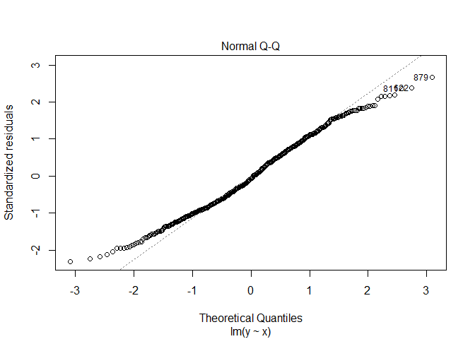
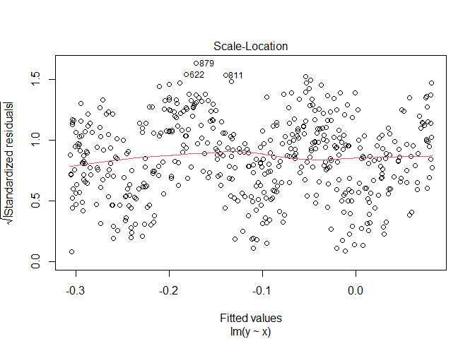
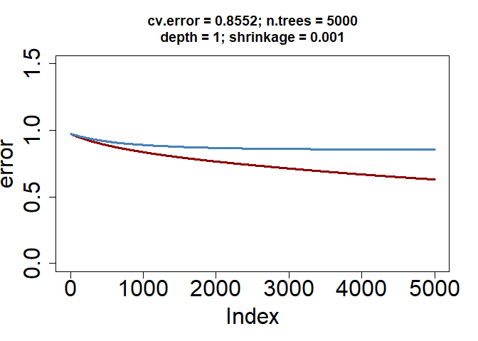

### Exercise 1 (Analysis/conceptual)
You will assess how well a tree model can capture non-linearities by fitting a regression tree to simulated non-linear data.

i. Simulate the data


```r
library(mlr)
```

```
## Loading required package: ParamHelpers
```

```
## Warning message: 'mlr' is in 'maintenance-only' mode since July 2019.
## Future development will only happen in 'mlr3'
## (<https://mlr3.mlr-org.com>). Due to the focus on 'mlr3' there might be
## uncaught bugs meanwhile in {mlr} - please consider switching.
```

```r
library(randomForest)
```

```
## randomForest 4.7-1
```

```
## Type rfNews() to see new features/changes/bug fixes.
```

```r
library(rpart)
library(rpart.plot)

set.seed(1984) 
n = 1000
x = runif(n, -5, 5) # n observations uniformly distributed in the interval -5 to 5
error = rnorm(n, sd=0.5)
y = sin(x) + error # nonlinear relationship between outcome y and feature x
nonlin = data.frame(y=y, x=x)
```

ii. Split the data into training and testing (500 observations in each). Plot the data -- scatterplot of y vs. x

```r
train = sample(1:nrow(nonlin), floor(nrow(nonlin)*0.5)); test = setdiff(1:nrow(nonlin), train)
```

iii. Fit a regression tree using the trainig set 


```r
library(rpart)
treefit = rpart(y~x, method='anova', control=list(cp=0), data=nonlin[train,]) # Method='anova' indicate sregression tree. cp=0 ensures that binary recursive partitioning will not stop early due to lack of improvement in RSS by an amount  of at least cp
```

iv. Plot the fitted regression tree


```r
plot(treefit) # plots the tree
text(treefit) # annotates the tree. May fail if tree is too large
```

<!-- -->

```r
library(rpart.plot)
rpart.plot(treefit) #the rpart.plot function generates better looking trees!
```

<!-- -->

Note: the height of the branches are proportional to the improvement in RSS

v. Plot the cv relative error to determine the optimal complexity parameter


```r
plotcp(treefit)
```

<!-- -->

vi. Print the table complexity parameter values and their associated cv-errors


```r
printcp(treefit)
```

```
## 
## Regression tree:
## rpart(formula = y ~ x, data = nonlin[train, ], method = "anova", 
##     control = list(cp = 0))
## 
## Variables actually used in tree construction:
## [1] x
## 
## Root node error: 419.01/500 = 0.83803
## 
## n= 500 
## 
##            CP nsplit rel error  xerror     xstd
## 1  0.19469747      0   1.00000 1.00402 0.050219
## 2  0.03406113      3   0.41591 0.45381 0.026383
## 3  0.02739341      4   0.38185 0.40052 0.023812
## 4  0.01891662      5   0.35445 0.39357 0.023724
## 5  0.01874134      6   0.33554 0.39609 0.023979
## 6  0.01213232      7   0.31680 0.37331 0.023124
## 7  0.01177426      8   0.30466 0.36034 0.021451
## 8  0.01068066      9   0.29289 0.35782 0.021471
## 9  0.00730259     10   0.28221 0.35344 0.021672
## 10 0.00227267     11   0.27491 0.33708 0.021305
## 11 0.00186823     13   0.27036 0.34227 0.021753
## 12 0.00171551     14   0.26849 0.34012 0.021647
## 13 0.00166389     16   0.26506 0.34075 0.021424
## 14 0.00126849     17   0.26340 0.34414 0.021929
## 15 0.00123808     19   0.26086 0.34552 0.021905
## 16 0.00121855     20   0.25962 0.34655 0.022026
## 17 0.00115604     21   0.25840 0.34803 0.022231
## 18 0.00111863     23   0.25609 0.34825 0.022214
## 19 0.00110532     24   0.25497 0.35007 0.022234
## 20 0.00108254     25   0.25387 0.35007 0.022234
## 21 0.00087341     26   0.25278 0.35390 0.022350
## 22 0.00086753     27   0.25191 0.36035 0.022815
## 23 0.00080057     28   0.25104 0.36103 0.022826
## 24 0.00076602     29   0.25024 0.36130 0.022709
## 25 0.00076067     30   0.24948 0.36133 0.022746
## 26 0.00075427     31   0.24872 0.35925 0.022411
## 27 0.00073981     33   0.24721 0.35917 0.022339
## 28 0.00064851     34   0.24647 0.35940 0.022331
## 29 0.00060051     36   0.24517 0.36094 0.022550
## 30 0.00045151     37   0.24457 0.36233 0.022691
## 31 0.00041738     38   0.24412 0.36509 0.022741
## 32 0.00026822     39   0.24370 0.36484 0.022685
## 33 0.00014555     40   0.24343 0.36540 0.022761
## 34 0.00000000     41   0.24329 0.36465 0.022751
```

vii. Select the optimal complexity parameter and prune the tree


```r
optimalcp = treefit$cptable[which.min(treefit$cptable[,"xerror"]),"CP"] # for you to fill in
treepruned = prune(treefit, cp=optimalcp)
```

viii. Plot the pruned tree

```r
rpart.plot(treepruned)
```

<!-- -->

ix. Summarize the pruned tree object and relate the summary to the plotted tree above


```r
summary(treepruned)
```

```
## Call:
## rpart(formula = y ~ x, data = nonlin[train, ], method = "anova", 
##     control = list(cp = 0))
##   n= 500 
## 
##             CP nsplit rel error    xerror       xstd
## 1  0.194697471      0 1.0000000 1.0040153 0.05021945
## 2  0.034061135      3 0.4159076 0.4538104 0.02638272
## 3  0.027393414      4 0.3818465 0.4005153 0.02381225
## 4  0.018916616      5 0.3544530 0.3935674 0.02372447
## 5  0.018741339      6 0.3355364 0.3960865 0.02397866
## 6  0.012132319      7 0.3167951 0.3733062 0.02312415
## 7  0.011774257      8 0.3046628 0.3603378 0.02145075
## 8  0.010680660      9 0.2928885 0.3578205 0.02147093
## 9  0.007302594     10 0.2822078 0.3534446 0.02167188
## 10 0.002272669     11 0.2749053 0.3370788 0.02130490
## 
## Variable importance
##   x 
## 100 
## 
## Node number 1: 500 observations,    complexity param=0.1946975
##   mean=-0.1147421, MSE=0.8380283 
##   left son=2 (436 obs) right son=3 (64 obs)
##   Primary splits:
##       x < -3.484362   to the right, improve=0.1407386, (0 missing)
## 
## Node number 2: 436 observations,    complexity param=0.1946975
##   mean=-0.2463199, MSE=0.7852125 
##   left son=4 (193 obs) right son=5 (243 obs)
##   Primary splits:
##       x < -0.05508361 to the left,  improve=0.1965717, (0 missing)
## 
## Node number 3: 64 observations,    complexity param=0.01213232
##   mean=0.781632, MSE=0.2764066 
##   left son=6 (43 obs) right son=7 (21 obs)
##   Primary splits:
##       x < -4.612867   to the right, improve=0.2873718, (0 missing)
## 
## Node number 4: 193 observations,    complexity param=0.03406113
##   mean=-0.6871574, MSE=0.3678353 
##   left son=8 (169 obs) right son=9 (24 obs)
##   Primary splits:
##       x < -2.955229   to the right, improve=0.2010375, (0 missing)
## 
## Node number 5: 243 observations,    complexity param=0.1946975
##   mean=0.1038103, MSE=0.839768 
##   left son=10 (98 obs) right son=11 (145 obs)
##   Primary splits:
##       x < 3.133467    to the right, improve=0.5805772, (0 missing)
## 
## Node number 6: 43 observations
##   mean=0.5846748, MSE=0.2062735 
## 
## Node number 7: 21 observations
##   mean=1.184925, MSE=0.1779356 
## 
## Node number 8: 169 observations,    complexity param=0.01177426
##   mean=-0.7896347, MSE=0.3017005 
##   left son=16 (121 obs) right son=17 (48 obs)
##   Primary splits:
##       x < -0.8897254  to the left,  improve=0.09676081, (0 missing)
## 
## Node number 9: 24 observations
##   mean=0.03445331, MSE=0.2388637 
## 
## Node number 10: 98 observations,    complexity param=0.01874134
##   mean=-0.7455278, MSE=0.3121068 
##   left son=20 (69 obs) right son=21 (29 obs)
##   Primary splits:
##       x < 3.814829    to the right, improve=0.2567438, (0 missing)
## 
## Node number 11: 145 observations,    complexity param=0.02739341
##   mean=0.6778457, MSE=0.3793274 
##   left son=22 (21 obs) right son=23 (124 obs)
##   Primary splits:
##       x < 0.4782685   to the left,  improve=0.2086857, (0 missing)
## 
## Node number 16: 121 observations,    complexity param=0.01068066
##   mean=-0.8972479, MSE=0.3048796 
##   left son=32 (71 obs) right son=33 (50 obs)
##   Primary splits:
##       x < -2.103778   to the right, improve=0.1213146, (0 missing)
## 
## Node number 17: 48 observations
##   mean=-0.5183597, MSE=0.1909035 
## 
## Node number 20: 69 observations
##   mean=-0.9290447, MSE=0.2562326 
## 
## Node number 21: 29 observations
##   mean=-0.3088841, MSE=0.1742598 
## 
## Node number 22: 21 observations
##   mean=-0.005837036, MSE=0.2249018 
## 
## Node number 23: 124 observations,    complexity param=0.01891662
##   mean=0.7936307, MSE=0.3129137 
##   left son=46 (26 obs) right son=47 (98 obs)
##   Primary splits:
##       x < 2.54086     to the right, improve=0.20428, (0 missing)
## 
## Node number 32: 71 observations
##   mean=-1.058638, MSE=0.2497405 
## 
## Node number 33: 50 observations
##   mean=-0.6680742, MSE=0.2936702 
## 
## Node number 46: 26 observations
##   mean=0.3027775, MSE=0.233719 
## 
## Node number 47: 98 observations,    complexity param=0.007302594
##   mean=0.9238571, MSE=0.2530437 
##   left son=94 (26 obs) right son=95 (72 obs)
##   Primary splits:
##       x < 0.9713606   to the left,  improve=0.1233912, (0 missing)
## 
## Node number 94: 26 observations
##   mean=0.6298082, MSE=0.2488088 
## 
## Node number 95: 72 observations
##   mean=1.030041, MSE=0.2120744
```

x. Based on the plot and/or summary of the pruned tree create a vector of the (ordered) split points for variable x, and a vector of fitted values for the intervals determined by the split points of x.


```r
# for you to fill in
x_splits = c(-4.6,-3.5,-2.96,-2.1,-0.89,-0.055,0.48,0.97,2.5,3.1,3.8)

y_splits = c(1.2, 0.78,0.034,-0.67,-1.1,-0.52,-0.0058,0.58,1,0.63,-0.31,-0.93)
```

xi. Plot the step function corresponding to the fitted (pruned) tree


```r
plot(y~x, data=nonlin[train,])
stpfn = stepfun(x_splits, y_splits) #stepfun creates the step function 
plot(stpfn, add=TRUE, lwd=2, col='red4') #add=TRUE plots over the existing plot 
```

xii. Fit a linear model to the training data and plot the regression line. Contrats the quality of the fit of the tree model vs. linear regression by inspection of the plot


```r
lmfit = lm(y ~ x, data=nonlin[train,])
summary(lmfit)
```

```
## 
## Call:
## lm(formula = y ~ x, data = nonlin[train, ])
## 
## Residuals:
##      Min       1Q   Median       3Q      Max 
## -2.11037 -0.69868 -0.06587  0.68081  2.42672 
## 
## Coefficients:
##             Estimate Std. Error t value Pr(>|t|)   
## (Intercept) -0.11249    0.04072  -2.762  0.00595 **
## x           -0.03891    0.01414  -2.752  0.00614 **
## ---
## Signif. codes:  0 '***' 0.001 '**' 0.01 '*' 0.05 '.' 0.1 ' ' 1
## 
## Residual standard error: 0.9104 on 498 degrees of freedom
## Multiple R-squared:  0.01498,	Adjusted R-squared:  0.013 
## F-statistic: 7.573 on 1 and 498 DF,  p-value: 0.00614
```

```r
plot(lmfit)
```

<!-- --><!-- --><!-- -->

```r
abline(lmfit, col='blue', lwd=2)
```

<!-- -->
 
xiii. Compute the test MSE of the pruned tree and the linear regression model


### Exercise 2 (Analysis)
You will recreate the analysis of the heart data in the textbook and lecture. 

```r
heart <- read.csv("Heart.csv")
require(mlr)
require(randomForest)
require(rpart)
require(rpart.plot)

set.seed(301)
heart <- heart[complete.cases(heart), ]

heart$ChestPain <- as.factor(heart$ChestPain)
heart$Thal <- as.factor(heart$Thal)
heart$AHD <- as.factor(heart$AHD)
heart$AHD <- as.numeric(heart$AHD)-1
```

i.   Split the data into training and testing

```r
nh <- nrow(heart)
train_heart = sample(1:nrow(heart), floor(nrow(heart)*0.7)); test_heart = setdiff(1:nrow(heart), train)
```

ii.  Fit a classification tree using ``rpart``

```r
set.seed(301)
treefit_heart = rpart(AHD~., method='class', control=list(cp=0), data=heart[train_heart,]) 
```

iii. Plot the unpruned tree

```r
rpart.plot(treefit_heart)
```

<!-- -->

iv.  Plot the cv error

```r
min(treefit_heart$cptable[,"xerror"])*nrow(heart[train_heart,])
```

```
## [1] 93.15
```

```r
plotcp(treefit_heart)
```

<!-- -->

v. Prune the tree using the optimal complexity parameter

```r
optimalcp_heart = treefit_heart$cptable[which.min(treefit_heart$cptable[,"xerror"]),"CP"] 
treepruned_heart = prune(treefit_heart, cp=optimalcp_heart)
treepruned_heart$cptable
```

```
##      CP nsplit rel error xerror       xstd
## 1 0.530      0      1.00   1.00 0.07189633
## 2 0.045      1      0.47   0.55 0.06355035
## 3 0.040      3      0.38   0.56 0.06391419
## 4 0.000      5      0.30   0.45 0.05934424
```

vi. Plot the pruned tree

```r
rpart.plot(treepruned_heart)
```

<!-- -->

vii. Compute the test misclassification error


```r
treepruned_heart_predict = predict(treepruned_heart, newdata =heart[test_heart,], type='prob')
```


```r
library(pROC)
```

```
## Type 'citation("pROC")' for a citation.
```

```
## 
## Attaching package: 'pROC'
```

```
## The following objects are masked from 'package:stats':
## 
##     cov, smooth, var
```

```r
roc_test_heart = roc(heart$AHD[test_heart], treepruned_heart_predict[,1])
```

```
## Setting levels: control = 0, case = 1
```

```
## Setting direction: controls > cases
```

```r
print(auc(roc_test_heart)) 
```

```
## Area under the curve: 0.8654
```

```r
print(ci.auc(roc_test_heart))
```

```
## 95% CI: 0.8026-0.9282 (DeLong)
```

```r
cm <- table(heart$AHD[test_heart], as.numeric(treepruned_heart_predict[,1]>0.5))
    mmce <- 1 - (sum(diag(cm))/sum(cm))
    print(mmce)
```

```
## [1] 0.8333333
```
vii. Fit the tree with the optimal complexity parameter to the full data (training + testing)

```r
set.seed(301)
heart_full = rpart(AHD~., method='class', control=list(cp=0), data=heart) 
rpart.plot(heart_full)
```

<!-- -->

```r
optimalcp_full = heart_full$cptable[which.min(heart_full$cptable[,"xerror"]),"CP"] 
optimalcp_full
```

```
## [1] 0.01094891
```

```r
treepruned_full = prune(heart_full, cp=optimalcp_full)
treepruned_full$cptable
```

```
##           CP nsplit rel error    xerror       xstd
## 1 0.48905109      0 1.0000000 1.0000000 0.06270779
## 2 0.05109489      1 0.5109489 0.5620438 0.05512618
## 3 0.04014599      3 0.4087591 0.5109489 0.05339040
## 4 0.01094891      5 0.3284672 0.4014599 0.04886414
```

```r
rpart.plot(treepruned_full)
```

<!-- -->

```r
heart_full$cptable
```

```
##           CP nsplit rel error    xerror       xstd
## 1 0.48905109      0 1.0000000 1.0000000 0.06270779
## 2 0.05109489      1 0.5109489 0.5620438 0.05512618
## 3 0.04014599      3 0.4087591 0.5109489 0.05339040
## 4 0.01094891      5 0.3284672 0.4014599 0.04886414
## 5 0.00729927      7 0.3065693 0.4014599 0.04886414
## 6 0.00000000      8 0.2992701 0.4160584 0.04953866
```

```r
# cross validation error 
min(heart_full$cptable[,"xerror"])*nrow(heart)
```

```
## [1] 119.2336
```

### Exercise 3 -- Analysis
Compare the performance of classification trees, bagging, random forests, and boosting for predicting heart disease based on the ``heart`` data. 

i. Split the data into training and testing. Train each of the models on the training data and extract the cross-validation (or out-of-bag error for bagging and Random forest). 

```r
train = sample(1:nrow(heart), floor(nrow(heart)*0.7)); test = setdiff(1:nrow(heart), train)
```

   a. For classification trees use ``rpart`` with pruning. Plot the tree using ``fancyRpartPlot`` in package ``rattle``. Plot the variable importance .

```r
library(rattle)
```

```
## Loading required package: tibble
```

```
## Loading required package: bitops
```

```
## Rattle: A free graphical interface for data science with R.
## Version 5.5.1 Copyright (c) 2006-2021 Togaware Pty Ltd.
## Type 'rattle()' to shake, rattle, and roll your data.
```

```
## 
## Attaching package: 'rattle'
```

```
## The following object is masked from 'package:randomForest':
## 
##     importance
```

```r
heart_cl = rpart(AHD ~ ., data=heart, method='class',
 control=list(minsplit = 15, minbucket = 5, cp = 0))

heart_cl_pruned = prune(heart_cl, cp=0.032)
fancyRpartPlot(heart_cl_pruned, cex=0.6, yesno=2)
```

<!-- -->

   b. For bagging use ``randomForest`` with ``mtry`` equal to the number of features (all other parameters at their default values). Generate the variable importance plot using ``varImpPlot`` and extract variable importance from the ``randomForest`` fitted object using the ``importance`` function.

```r
set.seed(301)
heart_bg = randomForest(as.factor(AHD) ~ . , data = heart[train,],
                        strata = heart$AHD[train],
                        sampsize = as.vector(table(heart$AHD[train]))) 
#oob error rate
sum(heart_bg$err.rate[,1])
```

```
## [1] 101.9358
```

```r
varImpPlot(heart_bg, cex = 0.7, pt.cex = 1.2, n.var = 20, main = "", pch = 16,
 col = "red4")
```

<!-- -->

```r
#varimp = round(summary(heart_tree_pruned)$variable.importance, 2)
```

   c.  For random forests use ``randomForest`` with the default parameters. Generate the variable importance plot using ``varImpPlot`` and extract variable importance from the ``randomForest`` fitted object using the ``importance`` function. 

```r
heart_rf = randomForest(as.factor(AHD) ~ . , data = heart[train,],
                        mtry=dim(heart[train,])[2]-1,
                        strata = heart$AHD[train],
                        sampsize = as.vector(table(heart$AHD[train]))) 
#oob error rate
sum(heart_rf$err.rate[,1])
```

```
## [1] 111.6684
```

```r
varImpPlot(heart_rf, cex = 0.7, pt.cex = 1.2, n.var = 20, main = "", pch = 16,
 col = "red4")
```

<!-- -->

```r
#important.par<-importance(heart_rf)[order(importance(heart_rf)[,1], decreasing = TRUE),]
```

   d. For boosting use `gbm` with ``cv.folds=5`` to perform 5-fold cross-validation, and set ``class.stratify.cv`` to ``AHD`` (heart disease outcome) so that cross-validation is performed stratifying by ``AHD``.  Plot the cross-validation error as a function of the boosting iteration/trees (the `$cv.error` component of the object returned by ``gbm``) and determine whether additional boosting iterations are warranted. If so, run additional iterations with  ``gbm.more`` (use the R help to check its syntax). Choose the optimal number of iterations. Use the ``summary.gbm`` function to generate the variable importance plot and extract variable importance/influence (``summary.gbm`` does both). Generate 1D and 2D marginal plots with ``gbm.plot`` to assess the effect of the top three variables and their 2-way interactions. 

```r
library(gbm, warn.conflicts = FALSE)
```

```
## Loaded gbm 2.1.8
```

```r
n <- nrow(heart)
train = sample(1:nrow(heart), floor(nrow(heart)*0.7)); test = setdiff(1:nrow(heart), train)

set.seed(301)
heart_boost = gbm(AHD ~ . , data=heart[train,], 
                    distribution='bernoulli', n.trees=3000,
                    interaction.depth = 1,
                    shrinkage = 0.01,
                    cv.folds=5, class.stratify.cv=TRUE)

plot(heart_boost$train.error, cex.lab=2, cex.axis=2, col='red4', type='l', lwd=3, 
         ylim=c(0,1.5), ylab="error")
lines(heart_boost$cv.error, col='steelblue', lwd=3)
```

<!-- -->

   
 e.  Compute the AUC for the 4 methods and comment on their relative performance.t missclassification error for the 4 methods and comment on their relative performance.

```r
print("===random forest===") 
```

```
## [1] "===random forest==="
```

```r
heart_rf_predict = predict(heart_rf, newdata = heart[test, ], 
                              type='response')

roc_test = roc(heart$AHD[test], as.numeric(heart_rf_predict)-1) 
```

```
## Setting levels: control = 0, case = 1
```

```
## Setting direction: controls < cases
```

```r
auc(roc_test); ci.auc(roc_test)
```

```
## Area under the curve: 0.9332
```

```
## 95% CI: 0.8809-0.9855 (DeLong)
```

```r
cm <- table(heart$AHD[test], as.numeric(heart_rf_predict)-1)
mmce <- 1 - (sum(diag(cm))/sum(cm))
mmce
```

```
## [1] 0.06666667
```


```r
print("===bagging===") 
```

```
## [1] "===bagging==="
```

```r
heart_bg_predict = predict(heart_bg, newdata = heart[test, ], 
                              type='response')

roc_test = roc(heart$AHD[test], as.numeric(heart_bg_predict)-1) 
```

```
## Setting levels: control = 0, case = 1
```

```
## Setting direction: controls < cases
```

```r
auc(roc_test); ci.auc(roc_test)
```

```
## Area under the curve: 0.9332
```

```
## 95% CI: 0.8809-0.9855 (DeLong)
```

```r
cm <- table(heart$AHD[test], as.numeric(heart_bg_predict)-1)
mmce <- 1 - (sum(diag(cm))/sum(cm))
mmce
```

```
## [1] 0.06666667
```

```r
print("===boost===") 
```

```
## [1] "===boost==="
```

```r
heart_boost_predict = predict(heart_boost, newdata = heart[test, ], 
                              type='response', n.trees=which.min(heart_boost$cv.error))


roc_test = roc(heart$AHD[test], as.numeric(heart_boost_predict>0.5)) 
```

```
## Setting levels: control = 0, case = 1
## Setting direction: controls < cases
```

```r
auc(roc_test); ci.auc(roc_test)
```

```
## Area under the curve: 0.8209
```

```
## 95% CI: 0.7407-0.9011 (DeLong)
```

```r
cm <- table(heart$AHD[test], as.numeric(heart_boost_predict>0.5))
mmce <- 1 - (sum(diag(cm))/sum(cm))
mmce
```

```
## [1] 0.1777778
```

ii. (Extra Credit) Perform the comparison between methods in i) using mlr3 benchmark and add to the mix of methods the boosting implemented in xgboost 


### Exercise 3 -- Analysis/conceptual 
Yo will evaluate the effect of critical boosting parameters (number of boosting iterations, shrinkage/learning rate, and tree depth/interaction) on the Metabric data.  In ``gbm`` the number of iterations is controlled by ``n.trees`` (default is 100), the shrinkage/learning rate is controlled by ``shrinkage`` (default is 0.001), and interaction depth by ``interaction.depth`` (default is 1).

i. Split the metabric data into training and testing. 

```r
load("metabric.Rdata")
set.seed(2022)
train = sample(1:nrow(metabric), floor(nrow(metabric)*0.7)); 
test = setdiff(1:nrow(metabric), train)
table(metabric$y[train])
```

```
## 
##   0   1 
## 455 107
```

```r
metabric$y <- as.numeric(metabric$y)-1
```
ii. Set the seed and train a boosting classification with ``gbm`` using 10-fold cross-validation (``cv.folds=10``) on the training data with ``n.trees = 5,000``, ``shrinkage = 0.001``, and ``interaction.depth =1``. Plot the cross-validation errors as a function of the boosting iteration.

```r
library(gbm, warn.conflicts = FALSE)
set.seed(2022)
   metabric_boost= gbm(y ~ . , data=metabric[train,], 
                    distribution='bernoulli', n.trees=5000,
                    interaction.depth = 1,
                    shrinkage = 0.001,
                    cv.folds=10, class.stratify.cv=TRUE)
```


```r
plot(metabric_boost$train.error, cex.lab=2, cex.axis=2, col='red4', type='l', lwd=3,  xlim=c(0,5000),
         ylim=c(0,1.5), ylab="error", main= paste0("cv.error = ",round(min(metabric_boost$cv.error),4),
                                                   "; n.trees = ", 5000,
                                                   "\ndepth = ", 1, "; shrinkage = ", 0.001))
lines(metabric_boost$cv.error, col='steelblue', lwd=3)
```

<!-- -->


```r
metabric_boost_predict = predict(metabric_boost, newdata = metabric[test, ], type='response')
```

```
## Using 4675 trees...
```


```r
require(pROC)
roc_test = roc(metabric$y[test], metabric_boost_predict) 
```

```
## Setting levels: control = 0, case = 1
```

```
## Setting direction: controls < cases
```

```r
    print(auc(roc_test))
```

```
## Area under the curve: 0.6745
```

```r
    print(ci.auc(roc_test))
```

```
## 95% CI: 0.5711-0.778 (DeLong)
```

```r
    cm <- table(metabric$y[test], as.numeric(metabric_boost_predict>0.5))
    mmce <- 1 - (sum(diag(cm))/sum(cm))
    print(mmce)
```

```
## [1] 0.153527
```


```r
library(pROC)
##a.a
as.data.frame(head(summary(metabric_boost, plotit = FALSE), 3))
```

```
##                       var  rel.inf
## ILMN_2166524 ILMN_2166524 7.637979
## ILMN_1770085 ILMN_1770085 6.313024
## ILMN_1780188 ILMN_1780188 4.042201
```

```r
pa1 = plot(metabric_boost, i.var=c('ILMN_1770085'), type='response', return.grid=TRUE)
plot(pa1, type ='l', lwd=3, col='red4', cex.axis=1, cex.lab=1)
```

<!-- -->
iii. Repeat ii. using the same seed and ``n.trees=5,000`` with the following 3 additional combination of parameters: a) ``shrinkage = 0.001``, ``interaction.depth = 2``; b) ``shrinkage = 0.01``, ``interaction.depth = 1``; c) ``shrinkage = 0.01``, ``interaction.depth = 2``.

```r
library(gbm, warn.conflicts = FALSE)
set.seed(2022)
   metabric_boost_a = gbm(y ~ . , data=metabric[train,], 
                    distribution='bernoulli', n.trees=5000,
                    interaction.depth = 2,
                    shrinkage = 0.001,
                    cv.folds=10, class.stratify.cv=TRUE)
   metabric_boost_b = gbm(y ~ . , data=metabric[train,], 
                    distribution='bernoulli', n.trees=5000,
                    interaction.depth = 1,
                    shrinkage = 0.01,
                    cv.folds=10, class.stratify.cv=TRUE)
   metabric_boost_c = gbm(y ~ . , data=metabric[train,], 
                    distribution='bernoulli', n.trees=5000,
                    interaction.depth = 2,
                    shrinkage = 0.01,
                    cv.folds=10, class.stratify.cv=TRUE)
```


```r
plot(metabric_boost_a$train.error, cex.lab=2, cex.axis=2, col='red4', type='l', lwd=3,  xlim=c(0,5000),
         ylim=c(0,1.5), ylab="error", main= paste0("cv.error = ",round(min(metabric_boost_a$cv.error),4),
                                                   "; n.trees = ", 5000,
                                                   "\ndepth = ", 2, "; shrinkage = ", 0.001))
lines(metabric_boost_a$cv.error, col='steelblue', lwd=3)
```

<!-- -->


```r
metabric_boost_a_predict = predict(metabric_boost_a, newdata = metabric[test, ], type='response')
```

```
## Using 4069 trees...
```


```r
require(pROC)
roc_test_a = roc(metabric$y[test], metabric_boost_a_predict) 
```

```
## Setting levels: control = 0, case = 1
```

```
## Setting direction: controls < cases
```

```r
    print(auc(roc_test_a))
```

```
## Area under the curve: 0.6796
```

```r
    print(ci.auc(roc_test_a))
```

```
## 95% CI: 0.5774-0.7818 (DeLong)
```

```r
    cm <- table(metabric$y[test], as.numeric(metabric_boost_a_predict>0.5))
    mmce <- 1 - (sum(diag(cm))/sum(cm))
    print(mmce)
```

```
## [1] 0.1493776
```


```r
library(pROC)
##a.a
as.data.frame(head(summary(metabric_boost_a, plotit = FALSE), 3))
```

```
##                       var  rel.inf
## ILMN_2166524 ILMN_2166524 4.740165
## ILMN_1770085 ILMN_1770085 3.635768
## ILMN_1780188 ILMN_1780188 2.607487
```

```r
pa1_a = plot(metabric_boost, i.var=c('ILMN_1770085'), type='response', return.grid=TRUE)
plot(pa1, type ='l', lwd=3, col='red4', cex.axis=1, cex.lab=1)
```

<!-- -->


```r
plot(metabric_boost_b$train.error, cex.lab=2, cex.axis=2, col='red4', type='l', lwd=3,  xlim=c(0,5000),
         ylim=c(0,1.5), ylab="error", main= paste0("cv.error = ",round(min(metabric_boost_b$cv.error),4),
                                                   "; n.trees = ", 5000,
                                                   "\ndepth = ", 1, "; shrinkage = ", 0.01))
lines(metabric_boost_b$cv.error, col='steelblue', lwd=3)
```

<!-- -->


```r
metabric_boost_b_predict = predict(metabric_boost_b, newdata = metabric[test, ], type='response')
```

```
## Using 711 trees...
```


```r
require(pROC)
roc_test_b = roc(metabric$y[test], metabric_boost_b_predict) 
```

```
## Setting levels: control = 0, case = 1
```

```
## Setting direction: controls < cases
```

```r
    print(auc(roc_test_b))
```

```
## Area under the curve: 0.6772
```

```r
    print(ci.auc(roc_test_b))
```

```
## 95% CI: 0.5733-0.7811 (DeLong)
```

```r
    cm <- table(metabric$y[test], as.numeric(metabric_boost_b_predict>0.5))
    mmce <- 1 - (sum(diag(cm))/sum(cm))
    print(mmce)
```

```
## [1] 0.1618257
```


```r
library(pROC)
##a.a
as.data.frame(head(summary(metabric_boost_b, plotit = FALSE), 3))
```

```
##                       var  rel.inf
## ILMN_2166524 ILMN_2166524 3.086614
## ILMN_1780188 ILMN_1780188 2.232510
## ILMN_1838885 ILMN_1838885 2.196979
```

```r
pa1_b = plot(metabric_boost_b, i.var=c('ILMN_1770085'), type='response', return.grid=TRUE)
plot(pa1_b, type ='l', lwd=3, col='red4', cex.axis=1, cex.lab=1)
```

<!-- -->


```r
plot(metabric_boost_c$train.error, cex.lab=2, cex.axis=2, col='red4', type='l', lwd=3,  xlim=c(0,5000),
         ylim=c(0,1.5), ylab="error", main= paste0("cv.error = ",round(min(metabric_boost_c$cv.error),4),
                                                   "; n.trees = ", 5000,
                                                   "\ndepth = ", 2, "; shrinkage = ", 0.01))
lines(metabric_boost_c$cv.error, col='steelblue', lwd=3)
```

<!-- -->


```r
metabric_boost_c_predict = predict(metabric_boost_c, newdata = metabric[test, ], type='response')
```

```
## Using 467 trees...
```


```r
require(pROC)
roc_test_c = roc(metabric$y[test], metabric_boost_c_predict) 
```

```
## Setting levels: control = 0, case = 1
```

```
## Setting direction: controls < cases
```

```r
    print(auc(roc_test_c))
```

```
## Area under the curve: 0.6907
```

```r
    print(ci.auc(roc_test_c))
```

```
## 95% CI: 0.5894-0.7919 (DeLong)
```

```r
    cm <- table(metabric$y[test], as.numeric(metabric_boost_c_predict>0.5))
    mmce <- 1 - (sum(diag(cm))/sum(cm))
    print(mmce)
```

```
## [1] 0.1576763
```


```r
library(pROC)
##a.a
as.data.frame(head(summary(metabric_boost_c, plotit = FALSE), 3))
```

```
##                       var  rel.inf
## ILMN_2166524 ILMN_2166524 3.132056
## ILMN_1780188 ILMN_1780188 1.908543
## ILMN_1838885 ILMN_1838885 1.902303
```

```r
pa1_c = plot(metabric_boost_c, i.var=c('ILMN_1770085'), type='response', return.grid=TRUE)
plot(pa1_c, type ='l', lwd=3, col='red4', cex.axis=1, cex.lab=1)
```

<!-- -->


iii. Choose the best parameter combination among the ones examinded above to a) generate 1D and 2D marginal plots with ``gbm.plot`` to assess the effect of the top three variables and their 2-way interactions; b) compute the test missclassification error and AUC.

Combination b has the largest auc 0.6816.


```r
metabric_boost_b_predict = predict(metabric_boost_b, newdata = metabric[test, ], type='response')
```

```
## Using 711 trees...
```


```r
require(pROC)
roc_test_b = roc(metabric$y[test], metabric_boost_b_predict) 
```

```
## Setting levels: control = 0, case = 1
```

```
## Setting direction: controls < cases
```

```r
    print(auc(roc_test_b))
```

```
## Area under the curve: 0.6772
```

```r
    print(ci.auc(roc_test_b))
```

```
## 95% CI: 0.5733-0.7811 (DeLong)
```

```r
    cm <- table(metabric$y[test], as.numeric(metabric_boost_b_predict>0.5))
    mmce <- 1 - (sum(diag(cm))/sum(cm))
    print(mmce)
```

```
## [1] 0.1618257
```


```r
library(pROC)
##a.a
as.data.frame(head(summary(metabric_boost_b, plotit = FALSE), 3))
```

```
##                       var  rel.inf
## ILMN_2166524 ILMN_2166524 3.086614
## ILMN_1780188 ILMN_1780188 2.232510
## ILMN_1838885 ILMN_1838885 2.196979
```

```r
pa1_b = plot(metabric_boost_b, i.var=c('ILMN_1770085'), type='response', return.grid=TRUE)
plot(pa1_b, type ='l', lwd=3, col='red4', cex.axis=1, cex.lab=1)
```

<!-- -->


